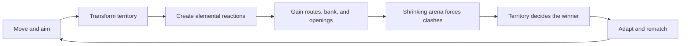

# EntropyTag

> **An original third-person elemental territory shooter where the battlefield remembers every clash.**

EntropyTag is a planned Unity game about movement, territory, and elemental counterplay. Players join Ice,
Water, or Fire teams, transform a 3D arena with their element, exploit friendly terrain, trigger multi-step
reactions, disrupt opposing players, and adapt as the playable space contracts toward a decisive finish.

The Unity foundation, player movement, multi-surface painting, and Ice/Fire/Mist reaction proofs are
implemented. A two-minute match with two mobile, competing bots is now ready for developer review. The generated Unity
project lives under `EntropyTag/`, while documentation and executable planning remain at the repository root.

## The game we are building



### Product pillars

1. **Territory is movement** - Friendly terrain creates routes and advantages, not only score.
2. **Elements leave history** - Ice, Water, Fire, Frozen, Puddle, and Mist form readable multi-step reactions.
3. **Short matches tell stories** - Expansion, contest, compression, and a final scramble fit into a compact
   session.
4. **Actions are visually honest** - Aim, spray contact, debuffs, ownership, and scoring must match what
   players see.
5. **Easy to start, worth mastering** - Simple objectives support deeper movement, aiming, reaction, timing,
   and team decisions.
6. **Original identity** - Genre inspiration is welcome; copied characters, maps, branding, art, audio, or
   proprietary assets are not.

## Target experience

- True 3D gameplay in Unity.
- Third-person movement with a free reticle and continuously following mouse/right-stick camera.
- Stylized low-poly environments with crisp, retro-inspired rendering.
- Paintable planar floors, walls, ramps, and platforms; arbitrary production meshes remain later work.
- Offline play with bots for the first vertical slice.
- Approximately two-to-four-minute matches during early development.
- PC as the initial development and validation platform.
- Networking, progression, and broad content production deferred until the local core is fun.

## Prototype heritage

The original mechanics prototype lives separately at:

```text
C:\devdesk\gamedesk\EntropyTag_Prototype
```

That Python/Pygame build proved the basic loop: three elemental teams, territory conversion, terrain-based
movement, reaction states, bots, score banking, and a shrinking arena. The Unity game will preserve the
strongest ideas, but it is a new production architecture rather than a direct code port.

See [Prototype inheritance](docs/10_PROTOTYPE_INHERITANCE.md) for the small set of rules worth carrying
forward and the prototype limitations that must not be repeated.

## Current repository status

| Area | Status |
|---|---|
| Product vision | Documented |
| Core game design | Documented for vertical-slice planning |
| Technical architecture | Foundation assemblies implemented and validated |
| Unity project | Created under `EntropyTag/` with Unity `2022.3.47f1` |
| Render pipeline | URP `14.0.11`, active in Graphics and all Quality levels |
| Input | Input System `1.7.0`; keyboard/mouse and gamepad drive the player sandbox |
| Gameplay code | Movement, territory, reactions, affinity, match flow, two mobile bots, and non-lethal hits |
| First-party assets | Approved hierarchy created under `EntropyTag/Assets/EntropyTag/` |
| Automated validation | Full baseline: 180 EditMode / 44 PlayMode; bot-targeting follow-up: 69 policy / 9 PlayMode tests passed. Windows build and graphics startup succeed (2026-09-10) |
| Match Flow and Scoring | Implemented; hands-on approval pending |
| Bots and AI | Two win-focused bot instances implemented; hands-on approval pending |
| Vertical slice | In progress; authored arena, production presentation, and final quality gates remain unfinished |
| Online multiplayer | Deferred |

## Try the current proof

Open `EntropyTag/Assets/EntropyTag/Scenes/Tests/Sandbox_PlayerMovement.unity` in Unity and enter Play Mode.
It starts in unrestricted free play: move, paint, and use `Tab` / gamepad Y to switch Ice and Fire.

Press **Enter / gamepad Start** for a clean three-second countdown followed by a 120-second match.
The safe boundary shrinks during the final stretch; score counts upward-facing logical cells inside it.
Results show territory, bank, and reaction counts. Enter/Start rematches; `R` / View restarts an ongoing match.
Team choice is locked during countdown and active play. One fixed Ice bot and one fixed Fire bot start moving
and competing when the match begins; they remain idle in free play. They paint, contest, prefer fighting
each other, and return toward the safe area. A substantially closer or more eligible hostile human can
still become the target. Enemy hits push players back rather than killing them.

Your selected team has two actors against one, so this is a testing arrangement rather than a balanced team
setup. Your teammate does not attack you. See [Competitive Bots](docs/16_COMPETITIVE_BOTS.md) for behavior,
navigation limits, shared rules, and the review checklist.

The official Windows build starts through `Bootstrap` into `Arena_FirstSlice`, a buildable copy of the
movement gym. Sandbox/comparison scenes remain excluded from that build. See
[Match Flow and Scoring](docs/15_MATCH_FLOW_SCORING.md) for controls, scoring, diagrams, and review steps.

## Documentation

### Start here

- [Vision and product pillars](docs/00_VISION.md)
- [Game design](docs/01_GAME_DESIGN.md)
- [Vertical-slice plan](docs/05_VERTICAL_SLICE_PLAN.md)
- [Production roadmap](docs/06_PRODUCTION_ROADMAP.md)

### Engineering and production

- [Technical architecture](docs/02_TECHNICAL_ARCHITECTURE.md)
- [Unity project structure](docs/03_UNITY_PROJECT_STRUCTURE.md)
- [Asset pipeline](docs/04_ASSET_PIPELINE.md)
- [Testing and quality strategy](docs/07_TESTING_AND_QUALITY.md)
- [Decisions and risks](docs/08_DECISIONS_AND_RISKS.md)
- [Glossary](docs/09_GLOSSARY.md)
- [Prototype inheritance](docs/10_PROTOTYPE_INHERITANCE.md)
- [Player, camera, and input sandbox](docs/11_PLAYER_CAMERA_INPUT.md)
- [Domain Rules](docs/12_DOMAIN_RULES.md)
- [Territory Painting](docs/13_TERRITORY_PAINTING.md)
- [Element Reactions](docs/14_ELEMENT_REACTIONS.md)
- [Match Flow and Scoring](docs/15_MATCH_FLOW_SCORING.md)
- [Competitive Bots](docs/16_COMPETITIVE_BOTS.md)
- [Documentation catalogue](docs/DOCUMENTATION_CATALOGUE.json)

## Work planning

All implementation work is decomposed under [`TODO/`](TODO/00_INDEX.todo). Every file in that directory ends
with `.todo`.

A work area is complete only when:

- Its checklist is fully checked.
- Its acceptance criteria are satisfied.
- Validation evidence is recorded.
- The file status is changed to `DONE`.
- Related documentation and context are synchronized.

## Unity repository shape

```text
EntropyTag/
|-- EntropyTag/                Unity project root
|   |-- Assets/
|   |   `-- EntropyTag/        First-party assets, scripts, scenes, settings, and tests
|   |-- Packages/
|   |-- ProjectSettings/
|   `-- UserSettings/          Local only; ignored
|-- docs/
|-- TODO/
`-- README.md
```

The detailed layout and ownership rules are defined in
[Unity project structure](docs/03_UNITY_PROJECT_STRUCTURE.md).

## Development principles

- Build the smallest playable proof before scaling scope.
- Keep game rules testable without loading a Unity scene.
- Prefer data-driven tuning over constants buried in MonoBehaviours.
- Separate domain state, simulation, presentation, and platform integration.
- Profile territory painting before committing to arbitrary-surface coverage.
- Do not introduce networking before local movement, aiming, painting, scoring, and bots are stable.
- Treat documentation and TODO completion evidence as part of the product.

## Branch purpose

`workDesk/agentic` is the active implementation branch. Territory Painting and Element Reactions are
complete; Match Flow and Scoring plus Competitive Bots are implemented and awaiting hands-on approval before
completion and commit.
