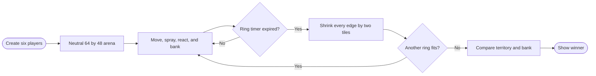
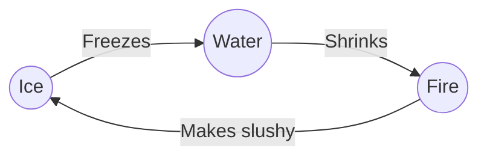
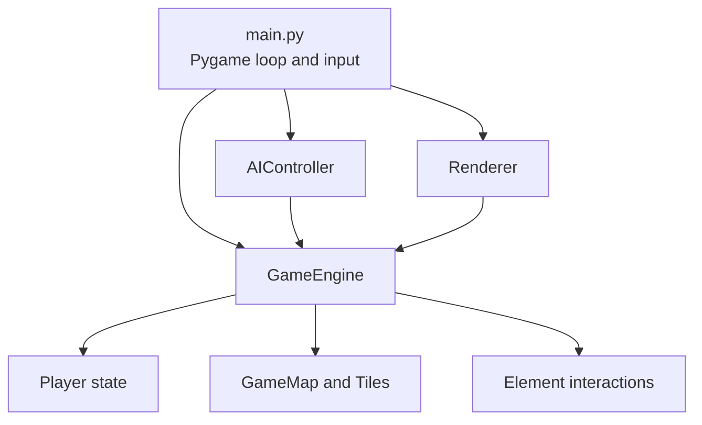

# EntropyTag - Elemental Territory Control

EntropyTag is a local multiplayer Pygame prototype about elemental territory control. Ice, Water, and Fire
teams move around a tile arena, spray terrain, trigger elemental reactions, disrupt opposing players, and
compete for the most territory before the shrinking ring ends the match.

The prototype supports three simultaneous human players and one bot teammate per team. It is designed as a
small, readable gameplay sandbox for experimenting with territory conversion, asymmetric elemental rules,
local multiplayer input, simple AI, and a shrinking-arena match structure.

## Quick start

Requirements:

- Python 3.10 or newer
- Pygame 2.5 or newer

Create an isolated environment and run the game on Windows:

```powershell
python -m venv .venv
.\.venv\Scripts\python.exe -m pip install -r requirements.txt
.\.venv\Scripts\python.exe main.py
```

If the included local environment is already usable, only the final command is required.

## Controls

| Player | Team | Movement | Spray |
|---|---|---|---|
| Player 1 | Ice | `W A S D` | Left Shift or Space |
| Player 2 | Water | `I J K L` | Right Shift |
| Player 3 | Fire | Xbox left stick | A or right trigger |
| Player 3 fallback | Fire | Arrow keys | Enter |

Global controls:

- `R` - restart the match.
- `F` - force the current match to end for debugging.
- `Esc` - quit.

The first connected controller is assigned to the Fire player. Keyboard fallback is enabled when no controller
is available, and controller hot-plugging is supported.

## How a match works

- The arena is a 64x48 grid of 16-pixel tiles.
- Each team has one human player and one bot.
- Spraying changes tile terrain and ownership.
- Elemental combinations can create Frozen terrain, Puddles, or Mist.
- Friendly terrain improves movement speed; hostile terrain can slow players.
- Countering elements apply temporary player debuffs.
- The ring removes two tiles from every edge about every ten seconds.
- When the ring can no longer shrink, the team owning the largest percentage of remaining territory wins.
- Close territory ties are resolved using banked conversion points.

At the intended 60 FPS, a match lasts approximately two minutes.



## Elemental rules

The player counter cycle is:



Terrain reactions are more detailed than the player counter cycle. For example:

- Ice freezes Water and Puddles.
- Water turns Fire and Ice into Puddles.
- Fire turns Ice, Frozen terrain, and Water into Mist.
- Further spraying can convert reaction terrain into team-owned primary terrain.

See [Gameplay and rules](docs/GAMEPLAY.md) for the complete conversion table, movement modifiers, debuffs,
scoring, AI behavior, and win rules.

## Architecture



The gameplay simulation is intentionally separated from Pygame rendering. `GameEngine`, `Player`, `GameMap`,
and the interaction rules can run headlessly, while `main.py` handles devices and `Renderer` handles drawing.

See [Architecture](docs/ARCHITECTURE.md) for module responsibilities, frame order, data flow, extension points,
and current technical limitations.

## Documentation

- [Gameplay and rules](docs/GAMEPLAY.md) - teams, movement, terrain reactions, debuffs, bots, ring timing,
  scoring, and current gameplay limitations.
- [Architecture](docs/ARCHITECTURE.md) - module boundaries, state ownership, simulation order, timing,
  rendering, extension points, validation baseline, and known implementation issues.

The README and detailed guides contain 17 focused Mermaid diagrams for the core gameplay and code paths.

## Repository layout

```text
EntropyTag/
|-- main.py                 Entry point, controls, and main loop
|-- requirements.txt        Python dependencies
|-- game/
|   |-- ai.py               Bot decisions and steering
|   |-- constants.py        Enums, colors, and tuning
|   |-- engine.py           Simulation and match lifecycle
|   |-- interactions.py     Terrain and player counter rules
|   |-- player.py           Movement, spraying, and debuffs
|   |-- renderer.py         Pygame rendering and HUD
|   `-- terrain.py          Tile grid and shrinking ring
`-- docs/
    |-- ARCHITECTURE.md
    `-- GAMEPLAY.md
```

## Prototype status

The core loop is playable and a complete match can run to winner resolution. The code remains an early
prototype and currently has no automated tests, audio, menus, persistence, networking, player elimination, or
respawn system.

Known implementation issues are documented in
[Architecture - Known issues and dormant hooks](docs/ARCHITECTURE.md#known-issues-and-dormant-hooks).

## Development notes

- The simulation layer is independent of Pygame rendering and can be exercised headlessly.
- Gameplay timing is frame-based and tuned for 60 FPS.
- AI uses unseeded randomness, so match outcomes are nondeterministic.
- Generated virtual environments, bytecode, caches, and local tooling files are excluded by `.gitignore`.
