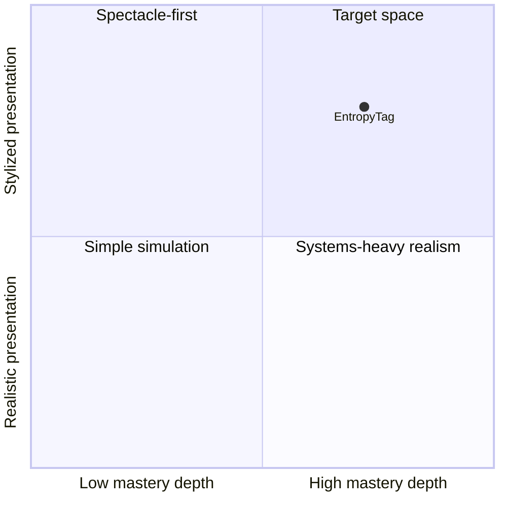

# Vision and Product Pillars

## North-star statement

EntropyTag is an original third-person territory action game where elemental teams reshape the battlefield,
use their own territory as mobility infrastructure, and create readable reaction chains that change how every
fight unfolds.

The target feeling is:

> "I understand what happened, I can imagine a better decision, and I want one immediate rematch."

## Player promise

In every match, the player should be able to:

- Create a route rather than merely damage an enemy.
- Read which team owns space and how that ownership changes movement.
- Cause an elemental reaction with a predictable result.
- Recognize the approaching match climax.
- Explain why the match was won or lost.
- Identify one tactic to try differently next time.

## Product pillars

### Territory is a traversal system

Territory must affect speed, recovery, safety, ability opportunities, and route planning. Painting is not a
background scoring chore; it is how teams construct tactical infrastructure.

### Elemental reactions are the signature

Ice, Water, and Fire should not be symmetric recolors. Their interactions must create temporary states such as
Frozen, Puddle, and Mist with visible ownership and gameplay consequences.

### Compression creates drama

The safe space contracts or objectives converge so that passive edge play cannot decide the entire match.
Pressure must be telegraphed and symmetric.

### Honest action

Visible spray geometry, hit detection, terrain state, movement effects, UI, audio, and score must agree.
Competitive trust is more important than spectacle.

### Short-session mastery

The first rules should be understood quickly, but mastery should grow through:

- Aim and movement coordination.
- Route creation.
- Reaction sequencing.
- Counter-matchup awareness.
- Resource and bank timing.
- Map and ring prediction.
- Team coordination.

### Original identity

EntropyTag can participate in the territory-shooter genre without imitating another game's expression.
Characters, world, terminology, silhouettes, UI, maps, effects, audio, and narrative must be original.

## Audience

### Primary

- Players who enjoy compact action matches.
- Couch or friend-group players who value rematches and rivalry.
- Players who enjoy movement mastery and visible map control.

### Secondary

- Solo players using bots to learn systems.
- Solo players who may later enjoy an original comedic precision-platformer expansion built around bounce,
  momentum, timing, and fast recovery from slapstick failure.
- Competitive players interested in readable tactical depth.
- Players attracted to stylized low-poly and retro-modern visuals.

## Product boundaries

### Included in the first vertical slice

- One original arena.
- One player character rig and controller.
- Third-person camera and aim.
- One spray tool.
- Floor territory painting.
- Ice and Fire as the first reaction pair.
- One bot archetype.
- Territory scoring and match timer.
- Minimal HUD, start, result, and rematch flow.

### Deferred expansion direction

- An original single-player precision-platformer mode may be explored after the main vertical slice.
- Its intended feel is comedic and deliberately demanding, using bounce/momentum traversal and readable
  hostile-environment slapstick.
- Genre inspirations must not become copied levels, characters, art, audio, names, narrative, or proprietary
  mechanical expression.

### Explicitly excluded

- Online accounts and matchmaking.
- Monetization.
- Persistent gameplay power.
- Large story campaign.
- Arbitrary wall/ceiling painting.
- Multiple maps or full character roster.
- Console certification.
- User-generated content.

## Success measures

The vertical slice succeeds when:

- A first-time player understands the objective within one match.
- Movement on owned territory feels meaningfully different.
- Players can predict the Ice/Fire reaction after seeing it twice.
- Spray contact and territory ownership appear trustworthy.
- A complete match runs without manual intervention.
- Playtesters voluntarily start a second match.
- The target PC maintains the agreed frame budget with territory painting active.

## Strategic position

