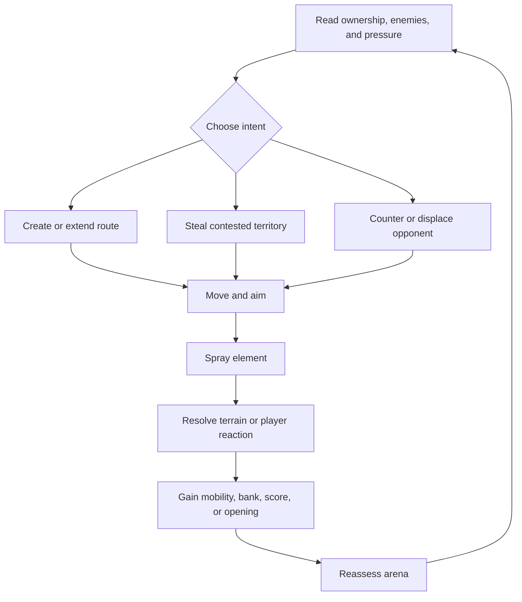

# Game Design

## Match summary

Two or three elemental teams enter a compact 3D arena. Players paint traversable surfaces, improve routes for
their team, contest enemy territory, trigger elemental reactions, and fight for the highest territory share
when the match ends.

The first vertical slice uses two teams to reduce implementation and balance variables. The three-team
structure remains the intended product direction.

The first vertical-slice match target is two minutes, including shrinking-boundary compression and
resolution.

## Core loop

## Match phases

### Opening

- Teams establish safe routes from spawn.
- Players learn the current arena state.
- Early painting creates mobility rather than decisive score.

### Contest

- Routes overlap around objectives and useful geometry.
- Reaction terrain becomes common.
- Bank or ability resources create tactical choices.

### Compression

- The playable zone contracts or scoring focus narrows.
- Previously safe routes become contested.
- Teams must choose between defending territory and forcing a swing.

### Resolution

- Final ownership is sampled consistently.
- Results explain territory, reactions, bank, and the decisive swing.
- Rematch is available immediately.

## Player movement

The controller target is responsive third-person arena movement:

- Camera-relative locomotion.
- Independent camera and aim.
- Acceleration tuned for responsiveness, not realism.
- Grounded jump only if level design proves it necessary.
- Friendly-territory speed or recovery advantage.
- Hostile-territory friction or reduced recovery rather than hard stun.
- Clear out-of-bounds and ring-pressure response.

Movement must remain useful when the spray tool is not active.

## Camera and aiming

- Over-the-shoulder camera.
- Aim reticle projected into world space.
- Camera collision prevents wall clipping.
- Spray origin and visible stream converge toward the aim solution.
- Gamepad aim assist, if added, must be subtle and configurable.
- Field of view, sensitivity, inversion, and camera shake require settings.

## Territory painting

### First implementation

- Paint only designated floor surfaces.
- Use a stable world-to-territory coordinate mapping.
- Store authoritative ownership at a lower logical resolution than display resolution.
- Render a smooth or stylized visual mask derived from logical ownership.
- Query territory beneath players for movement effects.
- Compute score from logical cells, not sampled screen pixels.

### Later expansion

- Slopes.
- Selected walls.
- Moving paintable objects.
- Reaction decay or timed states.
- Destructible or transformable map features.

## Elements

### Ice

- Identity: control, route stability, denial.
- Territory: fast, predictable traversal for Ice.
- First reaction: Ice applied to Fire territory creates neutral or contested Mist before Ice can claim it.
- Player effect proposal: brief chill buildup rather than immediate hard freeze.

### Water

- Identity: flow, displacement, conversion reliability.
- Territory: sustained movement and recovery.
- Reaction direction: converts Fire states efficiently and softens Frozen states.
- Deferred from the first slice to avoid balancing three teams immediately.

### Fire

- Identity: pressure, breakthrough, volatile conversion.
- Territory: aggressive movement or ability recovery.
- First reaction: Fire applied to Ice creates Mist, reducing direct ownership and opening a second conversion.
- Player effect proposal: temporary slush/heat disruption instead of health damage.

## Reaction-state principles

- Every reaction has a unique visual and audio signature.
- Ownership and state are separate concepts.
- Reaction rules are deterministic and data-driven.
- No reaction should require hidden timing knowledge.
- Multi-step reactions may earn bank when performed in contested space.
- Reaction terrain must not create unreadable color mixtures.

## Combat philosophy

The vertical slice is not a conventional lethal shooter.

- Primary interaction is territory transformation.
- Opponent hits create displacement, debuffs, resource denial, or brief vulnerability.
- The first slice has no elimination; direct hits cause brief slow, knockback, or temporary disable.
- Any later elimination experiment must remain a short interruption rather than the dominant score source.
- Spawn camping must be structurally prevented.
- Visible spray contact must match gameplay effects.

## Bank and abilities

First-slice model:

- Stealing enemy territory and completing reactions earns team bank.
- Bank is displayed but cannot be spent during the first slice.
- Passive ownership alone does not create runaway resource gain.
- A losing team gains slightly more bank for stealing leader-owned territory.

Later milestones may use bank to power one telegraphed elemental ability, so accumulation rules must preserve
that future option.

## Bots

The first bot needs only a small readable behavior set:

- Maintain a valid position inside the active arena.
- Paint a route toward a target zone.
- Contest nearby enemy territory.
- Avoid spraying forever when recovery is required.
- React to a nearby vulnerable opponent.
- Respect the same movement and spray rules as humans.

Later bot personalities: Painter, Hunter, Guardian, and Opportunist.

## Scoring

- Score is the percentage of active logical territory owned at match end.
- Neutral and reaction territory remains visible in the denominator.
- Close ties may use bank or a brief overtime objective; the decision remains open.
- Results must show how the winning score was produced.

## Match pressure

The first slice uses a predictable, visibly telegraphed shrinking safe boundary.

Later experiment candidates:

- Rotating high-value zone.
- Closing outer lanes.
- Final objective that activates after normal scoring.

The selected boundary must remain compatible with authored 3D maps and complete its compression within the
two-minute match target.

## Accessibility

- Color is never the only territory indicator.
- Element icons and material patterns accompany color.
- Reticle, camera shake, vibration, motion blur, and screen effects are configurable.
- Full keyboard/mouse and gamepad rebinding.
- Subtitle support for announcer information.
- UI scales across supported resolutions.

## Anti-goals

- Do not build progression before the match loop is fun.
- Do not use hard crowd control as the primary interaction.
- Do not reward continuous spraying without resource decisions.
- Do not hide comeback mechanics.
- Do not add online multiplayer to compensate for weak local gameplay.
