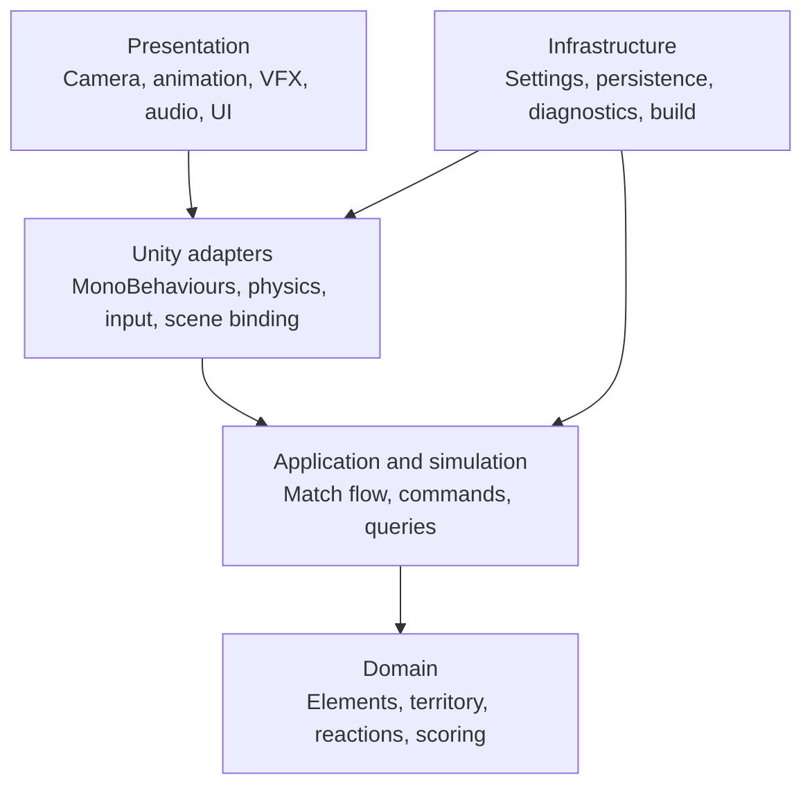
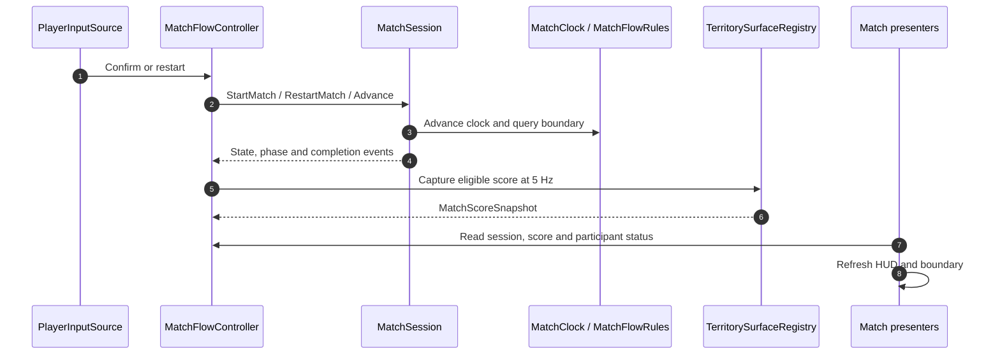
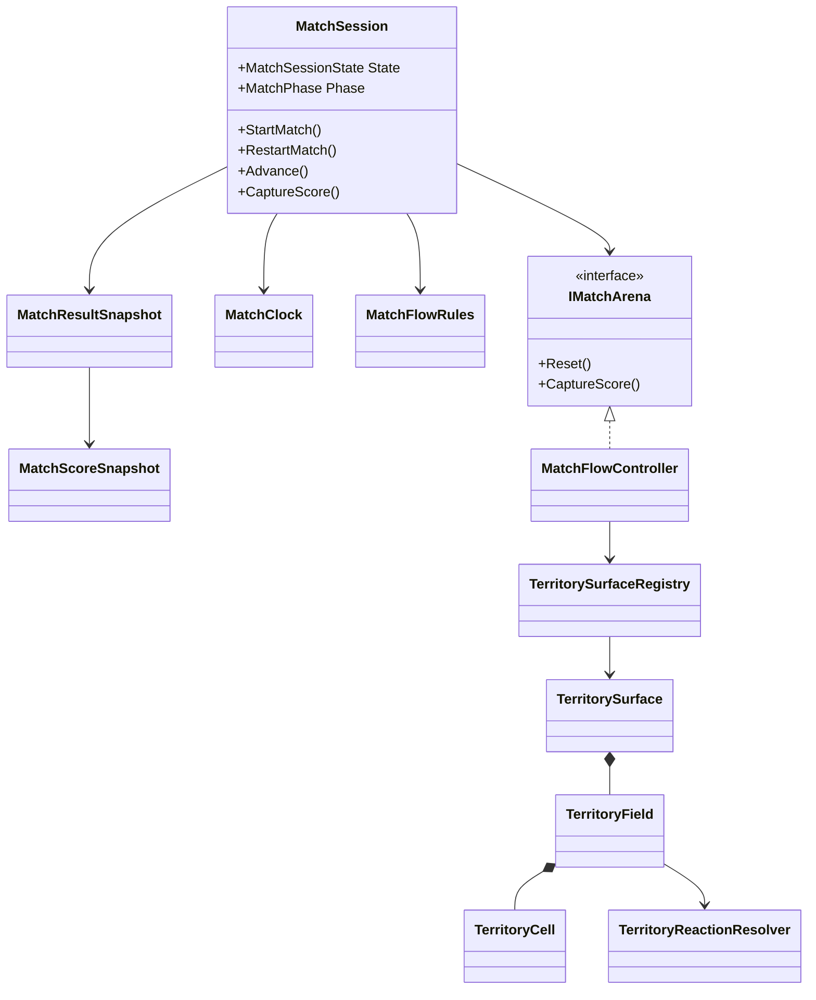
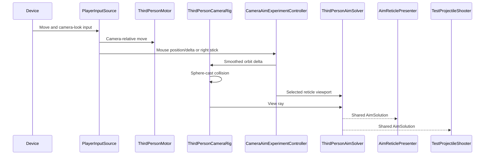

# Technical Architecture

## Architecture objective

Build a Unity game whose rules can be tested without scenes, whose presentation can change without rewriting
domain logic, and whose first vertical slice does not create accidental networking or content dependencies.

## Layer model

### Domain

Pure C# types with no dependency on `UnityEngine`.

Responsibilities:

- Element identities.
- Territory ownership and reaction state.
- Reaction resolution.
- Score and bank rules.
- Match phase and winner rules.
- Deterministic configuration validation.

### Application and simulation

Coordinates domain operations and exposes commands/events. The current engine-free implementation is
`MatchSession`: start/restart, countdown, phase advancement, boundary queries, completion events, and
immutable score/result snapshots. `BotTactics` is an engine-free utility policy over territory/opponent
observations. Unity actors now share `IActorIntentSource` and `IAimSource`; pause and generalized network
command submission remain planned.

Target responsibilities:

- Start, tick, pause, and complete a match.
- Accept player/bot intent.
- Apply territory mutations.
- Advance timers and match pressure.
- Emit typed events for presentation.
- Provide read-only snapshots or queries.

### Unity adapters

Connect Unity-specific systems to the simulation.

Responsibilities:

- Input System actions.
- CharacterController or chosen motor.
- Physics queries.
- Territory world-coordinate conversion.
- Scene object registration.
- MonoBehaviour lifecycle.

### Presentation

Consumes state and events; does not own game rules.

Responsibilities:

- Character visuals and animation.
- Spray VFX.
- Territory materials.
- Reaction feedback.
- Camera.
- UI and result presentation.
- Audio and rumble.

### Infrastructure

Cross-cutting services.

Responsibilities:

- Logging and diagnostics.
- Local settings.
- Save schema.
- Build metadata.
- Performance markers.
- Dependency composition.

## Foundation assemblies

| Assembly | Unity dependency | Purpose |
|---|---|---|
| `EntropyTag.Domain` | No | Rules, value objects, deterministic reactions; `noEngineReferences` is enabled |
| `EntropyTag.Application` | No | Match orchestration, commands, events; currently depends only on Domain |
| `EntropyTag.Unity` | Yes | Character, physics, input, territory adapters |
| `EntropyTag.Presentation` | Yes | Camera, UI, VFX, audio, animation |
| `EntropyTag.Infrastructure` | Yes | Settings, diagnostics, build integration |
| `EntropyTag.Editor` | Editor only | Foundation setup, scene generation, validation, and build commands |
| `EntropyTag.Tests.EditMode` | Test only | Domain and application tests |
| `EntropyTag.Tests.PlayMode` | Test only | Scene, input, physics, rendering smoke tests |

These assemblies exist under `EntropyTag/Assets/EntropyTag/`. Domain territory, reactions, bank, match timing,
and circular pressure rules are implemented. Application owns the match lifecycle without an engine
reference; Unity and Presentation connect it to the arena. The full initial baseline passed 180 EditMode
and 44 PlayMode tests; the bot-targeting follow-up passed 69 policy and 9 competitive-bot PlayMode tests.
Windows development build and graphics-enabled standalone startup also succeeded. Hands-on match review remains
pending; see [Match Flow and Scoring](15_MATCH_FLOW_SCORING.md).

`TerritoryBotController` supplies the same movement/fire intent consumed by `ThirdPersonMotor` and
`TestProjectileShooter`. `SandboxNavigation` bakes shared static collider route guidance once; it does not
move actors through a NavMeshAgent. `BotTerritoryMap` indexes reachable scoring locations, and `BotTactics`
chooses safety, recovery, territory, or enemy goals. Eligible bot opponents receive a bounded six-meter
distance bonus during target ranking, favoring bot-on-bot fights without immunity for the human.
Participant-role metadata comes from `MatchParticipant.IsBot`, not names or hard-coded actor indices.
Physical projectile collisions use a shared non-lethal
participant hit path. See [Competitive Bots](16_COMPETITIVE_BOTS.md) for the complete flow.

Dependencies flow inward. Domain must never reference presentation.

## Runtime composition

## Core domain model

The diagram uses implemented types rather than proposed `MatchState`, `TeamState`, or `PlayerState` classes.
`MatchSession` and snapshots are Application types; the controller and surface registry are Unity adapters.
`MatchClock`, `MatchFlowRules`, territory fields/cells, and the reaction resolver live in Domain.

## Territory representation

### Logical ownership

The sandbox now uses a deterministic logical field as the authority:

- Registered planar face grids aligned to designated floors, walls, ramps, and platforms; the main floor is
  64x64 and smaller faces use adaptive dimensions.
- Cell stores state, current owner, and previous-owner provenance for Mist.
- Scoring reads logical cells.
- Movement samples logical cells.
- Tests can construct fields without a GPU.

### Visual mask

The proof renders a higher-resolution visual projection:

- 256x256 RGBA32 `Texture2D` for the main floor, with 64- or 128-pixel textures for smaller faces.
- CPU pixel buffer updated from the same logical stamp command.
- Texture upload submitted at most once per frame.
- Point filtering keeps cell boundaries obvious during debugging.
- Runtime four-vertex face meshes use identity UVs, keeping world/logical coordinates aligned with rendering.
- Neutral overlay pixels are alpha-clipped, revealing a shared `#FCFCFA` lit structure material.
- Structures use a shared inverted-hull black material for low-cost manga-style silhouette outlines.

### Why not make pixels authoritative

- GPU readback complicates deterministic scoring.
- Different hardware may produce small sampling differences.
- Testing becomes expensive.
- Networking becomes substantially harder.
- Visual resolution becomes coupled to game rules.

### Prototype decision

The compared approaches were:

1. CPU logical grid plus GPU visual stamping.
2. GPU mask with CPU logical coverage written from the same stamp commands.

The selected proof keeps the CPU grid authoritative and projects its mutations into a GPU-resident texture.
This avoids readback, produces deterministic score/bot sampling, and keeps visual smoothing replaceable.
A later shader or RenderTexture path may improve edge quality without changing authority.

## Character system

The accepted motor proof is implemented in `Sandbox_PlayerMovement.unity`:

- Camera-relative movement input.
- Separate aim vector.
- Ground detection.
- Jump, wall climb/wall jump, and reduced-height slide.
- Marked spawn point with below-arena position recovery and motor-state reset.
- Acceleration and deceleration.
- External impulses for reactions.
- Friendly/hostile normal-locomotion multipliers; Neutral/Mist stays at normal speed.
- Variant 05 free reticle with continuously following mouse/right-stick camera control.
- Configurable camera smoothing and follow speed with sphere-cast collision.
- Shared physics aim solution through the selected reticle viewport position.
- Pooled test projectiles fired through the shared aim result.
- Reticle and contact marker consuming the shared solution.
- Persisted mouse/gamepad sensitivity and vertical inversion.

Do not place match scoring or elemental resolution inside the character controller.

See [Player, Camera, and Input Sandbox](11_PLAYER_CAMERA_INPUT.md).

## Spray system

The current pooled-projectile proof follows this pipeline:

1. Input requests spray.
2. Match control gates, firing interval, and pool availability approve or reject.
3. Aim solution produces origin and direction.
4. Physics query produces valid surface contacts.
5. Stamp command converts contacts into logical territory coordinates.
6. Domain resolver calculates resulting state and ownership.
7. Territory visual receives matching stamps.
8. Events drive VFX, audio, UI, and bank feedback.

The visible stream and authoritative contact must derive from the same aim solution.
The production continuous spray stream and resource economy are not implemented.

## Configuration

Use ScriptableObjects only as authored configuration and asset references.

Recommended data:

- Element definitions.
- Reaction rules.
- Movement tuning.
- Spray tuning.
- Match rules.
- Bot profiles.
- Map metadata.
- Audio/VFX references.

At runtime, validate and copy configuration into immutable or controlled domain values. Avoid using mutable
global ScriptableObjects as live match state.

## Scene strategy

Current runtime scenes:

- `Bootstrap` - initializes startup state and loads `Arena_FirstSlice` additively.
- `Arena_FirstSlice` - buildable three-actor match proof using the movement gym; made the active scene.
- `Sandbox_PlayerMovement` - selected developer scene, now with explicit opt-in match flow.
- `Sandbox_Camera_*` - eight retained free-play camera comparisons.

The official build command includes Bootstrap and the arena, filtering all sandbox scenes out of the
editor build list. Front-end menus and a final authored arena remain future work.

## Observability

- Structured logs for match start/end and invalid state.
- Unity Profiler markers around territory stamping, scoring, bot decisions, and rendering.
- On-screen development overlay for FPS, frame time, active stamps, territory cells, and bot state.
- Deterministic seed displayed in development builds.
- No silent catch-and-continue behavior for invalid configuration.

## Performance budgets

Initial PC targets:

- 60 FPS target.
- 16.67 ms total frame budget.
- Territory simulation target under 2 ms on representative hardware.
- Territory visual updates target under 3 ms during sustained spray.
- No per-frame managed allocations in core gameplay after warm-up.
- Bounded paint-mask memory documented per arena.

These are provisional and must be replaced with measured budgets after the first implementation.

## Networking boundary

Networking is deferred, but architecture should avoid obvious blockers:

- Commands represent player intent.
- Domain rules remain deterministic where practical.
- Match state has explicit ownership.
- Visual effects consume events and are not authoritative.
- Randomness is injected and seedable.

Do not build prediction, rollback, serialization, or transport in the first slice.

## Failure handling

- Invalid authored data fails at bootstrap with actionable messages.
- Missing required services block scene start rather than producing partial gameplay.
- Territory coordinate errors are asserted in development and safely rejected in release.
- Save/settings corruption falls back to versioned defaults and reports the failure.
- Build validation checks required scenes, input actions, and configuration assets.
