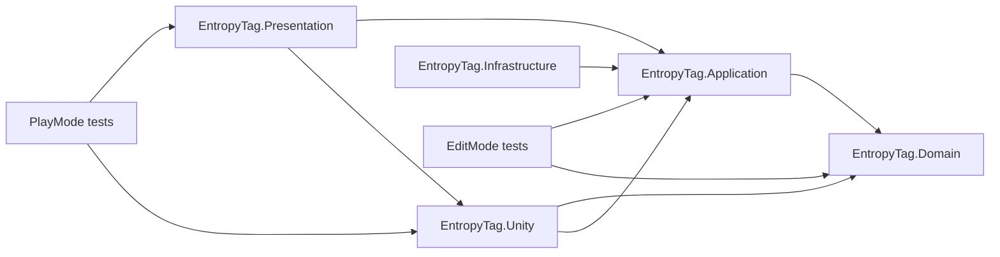

# Unity Project Structure

## Purpose

Define where every first-party file belongs inside the generated Unity project at `EntropyTag/`. Consistent
ownership prevents the Unity `Assets/` directory from becoming an unsearchable mixture of runtime code,
imports, experiments, and generated files.

## Planned repository tree

> **This is a target layout, not the current filesystem.** As of 2026-08-19, the existing Unity asset tree is
> only `EntropyTag/Assets/Scenes/SampleScene.unity`. Create planned folders only through an approved foundation
> task.

```text
EntropyTag/
|-- EntropyTag/                 Unity project root
|   |-- Assets/
|   |   |-- EntropyTag/
|   |   |   |-- Art/
|   |   |   |   |-- Characters/
|   |   |   |   |-- Environments/
|   |   |   |   |-- Props/
|   |   |   |   `-- Textures/
|   |   |   |-- Audio/
|   |   |   |   |-- Music/
|   |   |   |   |-- SFX/
|   |   |   |   `-- Voice/
|   |   |   |-- Materials/
|   |   |   |-- Prefabs/
|   |   |   |   |-- Characters/
|   |   |   |   |-- Gameplay/
|   |   |   |   |-- UI/
|   |   |   |   `-- VFX/
|   |   |   |-- Scenes/
|   |   |   |   |-- FrontEnd/
|   |   |   |   |-- Gameplay/
|   |   |   |   `-- Tests/
|   |   |   |-- Scripts/
|   |   |   |   |-- Application/
|   |   |   |   |-- Domain/
|   |   |   |   |-- Editor/
|   |   |   |   |-- Infrastructure/
|   |   |   |   |-- Presentation/
|   |   |   |   `-- Unity/
|   |   |   |-- Settings/
|   |   |   |   |-- Elements/
|   |   |   |   |-- Input/
|   |   |   |   |-- Maps/
|   |   |   |   `-- Tuning/
|   |   |   |-- Shaders/
|   |   |   |   |-- Includes/
|   |   |   |   |-- Territory/
|   |   |   |   `-- VFX/
|   |   |   |-- Tests/
|   |   |   |   |-- EditMode/
|   |   |   |   `-- PlayMode/
|   |   |   |-- UI/
|   |   |   `-- VFX/
|   |   |-- Plugins/
|   |   `-- ThirdParty/
|   |-- Packages/
|   |-- ProjectSettings/
|   `-- UserSettings/
|-- docs/
|-- TODO/
|-- .gitignore
`-- README.md
```

## Ownership rules

### `EntropyTag/Assets/EntropyTag/`

**Planned; not currently created.** All first-party source and authored assets will live here after the
project-foundation task creates and approves the hierarchy.

### `EntropyTag/Assets/ThirdParty/`

Imported asset-store or externally licensed content that must remain separated for attribution, upgrades, and
removal. Each package requires a license record.

### `EntropyTag/Assets/Plugins/`

Native libraries or Unity packages that specifically require this location. Do not use it for ordinary C#.

### `EntropyTag/Packages/`

Unity Package Manager manifest and lock file. Add dependencies intentionally; record why they are needed.

### `EntropyTag/ProjectSettings/`

Version-controlled Unity project configuration. Changes require review because they affect every developer.

### `EntropyTag/UserSettings/`

Local editor preferences. Never commit.

## Script organization

### `Domain/`

- No `UnityEngine` references.
- Value objects, enums, rules, territory state, reactions, score, match phase.
- Highest unit-test coverage.

### `Application/`

- Use cases, match orchestration, commands, events, queries.
- Depends on Domain.
- Avoid MonoBehaviours.

### `Unity/`

- MonoBehaviours.
- Physics, input, scene binding, character motor, territory surface adapters.
- Depends on Application and Domain.

### `Presentation/`

- Camera, UI presenters, VFX, audio, animation coordination.
- Consumes application state/events.

### `Infrastructure/`

- Settings persistence.
- Diagnostics.
- build/version information.
- Service composition.

### `Editor/`

- Custom inspectors.
- Validation windows.
- asset creation tools.
- Build menu commands.
- Must be isolated in editor-only assemblies.

## Assembly-definition layout

Every major script layer receives an `.asmdef`. Tests reference only the assemblies they exercise.



## Scene naming

| Pattern | Example | Purpose |
|---|---|---|
| `Bootstrap` | `Bootstrap.unity` | Application entry and service composition |
| `FrontEnd_*` | `FrontEnd_Main.unity` | Menus and settings |
| `Arena_*` | `Arena_Foundry01.unity` | Playable maps |
| `Test_*` | `Test_TerritoryPaint.unity` | Isolated development validation |
| `Sandbox_*` | `Sandbox_PlayerMotor.unity` | Temporary experiments; delete or promote |

## Prefab rules

- Prefabs represent reusable composition, not arbitrary folders of scene objects.
- Variants are used only when their inheritance remains understandable.
- Runtime-spawned prefabs have explicit factories or registries.
- Prefabs do not locate dependencies through global scene searches.
- Required references are serialized and validated.

## Asset addressing

Do not introduce Addressables in the first slice unless scene/profile data proves direct references are
insufficient. Premature addressable architecture creates build and lifecycle complexity.

## Generated content

Generated masks, baked navigation, caches, builds, captures, and temporary exports must use dedicated ignored
directories. Generated assets required at runtime must have a reproducible generation step.

## Naming rules

| Asset | Convention | Example |
|---|---|---|
| C# type/file | PascalCase | `TerritoryField.cs` |
| Interface | `I` + PascalCase | `ITerritorySampler.cs` |
| Scene | Category_Name | `Arena_Foundry01.unity` |
| Prefab | Category_Name | `Player_Ice.prefab` |
| Material | `M_` prefix | `M_TerritoryIce.mat` |
| Texture | `T_` prefix | `T_TerritoryNoise_A.png` |
| Mesh | `SM_` prefix | `SM_ArenaRamp_A.fbx` |
| Animation clip | `A_` prefix | `A_Player_Run.anim` |
| Animator controller | `AC_` prefix | `AC_Player.controller` |
| Audio clip | `SFX_` or `MUS_` | `SFX_IceSpray_Loop.wav` |
| ScriptableObject asset | `SO_` prefix | `SO_Element_Ice.asset` |
| VFX Graph | `VFX_` prefix | `VFX_ReactionMist.vfx` |

## Folder anti-patterns

- `Assets/Scripts/Misc`.
- Duplicate folders named `New Folder`.
- Third-party assets mixed into first-party folders.
- Runtime state stored in ScriptableObject assets.
- Scenes used as dependency containers.
- Resources folder used as a universal locator.
- Multiple unrelated systems in one assembly.
- Committed local builds or Library cache.
