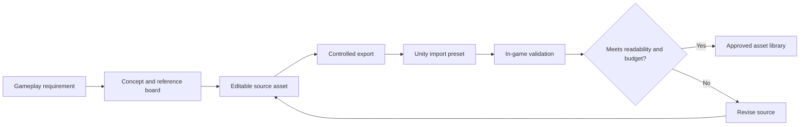

# Asset Pipeline

## Objective

Create a coherent original visual and audio identity while keeping assets replaceable during prototyping and
traceable from source file to Unity import.

## Art direction

Current target:

- True 3D geometry.
- Low-poly silhouettes.
- Crisp textures and controlled pixelation.
- Bold elemental material response.
- Readable forms at third-person camera distance.
- Modern lighting used selectively rather than photorealism.

Retro-inspired means deliberate constraints, not low quality.

## Visual pillars

### Readable teams

Ice, Water, and Fire require:

- Distinct hue families.
- Distinct material patterns.
- Distinct silhouette accents.
- Distinct VFX motion.
- Distinct audio envelope.

Color alone is insufficient.

### Readable territory

Territory materials must communicate:

- Owner.
- Reaction state.
- Paintability.
- Safe versus inactive area.
- Fresh change versus stable state.

### Restrained environments

Arena geometry should frame gameplay. Background detail must not compete with territory patterns, reticles,
players, or reaction effects.

## Asset lifecycle

## Source versus exported assets

- Preserve editable source files outside or in a clearly designated source-art location.
- Commit Unity-ready exports required to build the game.
- Avoid committing large iterative source files without an agreed storage strategy.
- Never overwrite an approved export without retaining source provenance.

## Character assets

First slice needs:

- One shared base rig.
- Two original team variants.
- Idle, locomotion, aim, spray, hit reaction, and result poses.
- Simple attachment points for spray tool and VFX.
- LOD strategy only after measured need.

Character silhouette must remain readable against all territory colors.

## Environment assets

Build a modular kit:

- Floors with paintable-surface metadata.
- Walls and blockers.
- Ramps.
- Cover modules.
- Spawn structures.
- Boundary and inactive-zone pieces.
- Objective markers.
- Background-only pieces.

Gameplay collision and visual mesh may differ, but both require validation.

## Territory materials and shaders

Required capabilities:

- Blend neutral, team, and reaction states.
- Apply patterns independently from color.
- Accept logical or visual mask updates.
- Avoid excessive shader variants.
- Support development overlays for cell boundaries and ownership.
- Maintain readability under all arena lighting.

Shader complexity requires profiling on the target PC before expansion.

## VFX

Every effect has a gameplay message:

| Effect | Message |
|---|---|
| Spray stream | Current aim and active element |
| Territory stamp | Contact location and ownership attempt |
| Reaction burst | A special conversion occurred |
| Player status | Debuff type and duration category |
| Ring warning | Space will become inactive |
| Bank gain | Meaningful contested action earned resource |
| Result celebration | Match outcome and team identity |

VFX must not obscure aim or ownership.

## Audio

Audio categories:

- Element-specific spray loops.
- Territory impact.
- Reaction stingers.
- Player movement by terrain state.
- Status effects.
- Match phase and ring warnings.
- UI.
- Music.
- Announcer or text-supported callouts.

Loop transitions must be click-free and respond quickly to input.

## UI assets

- Element icons.
- Team patterns.
- Reticle states.
- Territory bars.
- Bank/ability meter.
- Match timer.
- Status-effect icons.
- Controller and keyboard glyphs.
- Results categories.

UI source files must support scalable export and localization-safe layout.

## Import standards

- Use project import presets where practical.
- Disable unnecessary mesh read/write.
- Configure texture compression by asset category.
- Set audio load type intentionally.
- Validate scale and axis conventions on import.
- Record exceptions next to the asset or in importer tooling.

## Budgets

Initial budgets are provisional:

- One shared character rig for the slice.
- One arena material family.
- One territory shader.
- One VFX family per implemented element.
- Limited dynamic lights.
- Texture resolution chosen by on-screen size, not blanket maximums.
- Audio compressed according to duration and reuse.

## Licensing

Every third-party asset requires:

- Source URL or vendor.
- License text.
- Proof of allowed commercial use.
- Attribution requirement.
- Modification restrictions.
- Version.

No asset may be assumed safe because it was freely downloadable.

## Placeholder policy

Placeholders are allowed when:

- Clearly labeled.
- Legally usable.
- Not presented as final direction.
- Replaceable without gameplay-code changes.

Gray-box geometry is preferred over misleading near-final assets during mechanics validation.

