# Vertical-Slice Plan

## Slice objective

Prove that third-person movement, directional spraying, floor territory, one elemental reaction, one bot, and
a complete short match are fun, readable, and technically sustainable in Unity.

The slice is a decision instrument, not a miniature full game.

## Definition of playable

A player can:

1. Launch from a front-end screen.
2. Start a match in one arena.
3. Move and aim with keyboard/mouse or gamepad.
4. Spray floor territory.
5. Move differently on friendly and hostile territory.
6. Contest one bot.
7. Trigger the Ice/Fire Mist reaction.
8. Observe score and match time.
9. Complete the match.
10. Understand the result and rematch.

## Scope

### Included

- Unity project foundation.
- One low-poly gray-box arena.
- One shared thin-cuboid-and-sphere placeholder player rig.
- Ice and Fire teams.
- One spray tool.
- Floor-only painting.
- Logical territory field plus visual mask.
- Friendly/hostile movement modifier.
- At least one opposing-team bot behavior profile for solo interaction testing.
- Territory percentage.
- Two-minute match timer and shrinking safe boundary.
- Minimal front end, HUD, result, and rematch.
- EditMode and PlayMode tests.
- Development diagnostics.

### Excluded

- Water team.
- Online multiplayer.
- Split-screen unless it falls out cheaply from input architecture.
- Arbitrary wall or ceiling paint.
- Final art, audio, narrative, progression, cosmetics, accounts, monetization.
- Multiple maps.
- Multiple weapons.
- Full elemental abilities.

## Work gates

```mermaid
flowchart LR
    accTitle: EntropyTag vertical-slice gates
    accDescr: The slice advances through project foundation, movement, territory proof, reaction gameplay, complete match flow, and polish only when each preceding gate meets its acceptance criteria.

    foundation[Gate 1<br/>Project foundation]
    movement[Gate 2<br/>Movement and aim]
    territory[Gate 3<br/>Territory proof]
    reaction[Gate 4<br/>Reaction and bot]
    match[Gate 5<br/>Complete match]
    polish[Gate 6<br/>Readable slice]
    review([Go or revise decision])

    foundation --> movement --> territory --> reaction --> match --> polish --> review
```

## Gate 1: Project foundation

Deliver:

- Unity project created with agreed editor version.
- Repository ignore rules.
- URP or selected render pipeline recorded.
- Assembly definitions.
- Bootstrap and test scenes.
- Input actions.
- Test framework working in batch mode.
- Build validation command.

Exit criteria:

- Clean checkout opens without missing dependencies.
- EditMode and PlayMode sample tests pass.
- Development build targets 1080p at approximately 60 FPS on GTX 1060/RX 580-class graphics, a four-core
  CPU, and 8 GB RAM.

## Gate 2: Movement and aim

Deliver:

- Camera-relative player motor.
- Free reticle with continuously following third-person camera.
- Independent world-space aim.
- Camera collision.
- Keyboard/mouse and gamepad actions.
- Debug reticle and contact visualization.

Exit criteria:

- Movement feels responsive at target frame rate.
- Aim and visible contact agree.
- No per-frame managed allocation from the motor after warm-up.
- Sensitivity and inversion are configurable.

## Gate 3: Territory proof

Deliver:

- Paintable floor registration.
- Logical territory coordinates.
- Spray stamp commands.
- Visual territory mask.
- Ownership sampling beneath player.
- Friendly/hostile movement modifiers.
- Territory coverage calculation.
- Performance overlay.

Exit criteria:

- Score is deterministic for a fixed stamp sequence.
- Visual and logical ownership remain aligned.
- Sustained spray remains within the provisional frame budget.
- Arena reset fully clears territory.

## Gate 4: Reaction and bot

Deliver:

- Ice and Fire definitions.
- Mist reaction.
- Data-driven resolver.
- Reaction visual event.
- One bot that paints, contests, and respects the same rules.
- Seedable bot decisions.

Exit criteria:

- All conversion combinations under scope have tests.
- Players can predict the reaction from presentation.
- Bot completes matches without invalid positions or stuck loops.

## Gate 5: Complete match

Deliver:

- Match start.
- Timer.
- Shrinking safe boundary.
- Territory HUD.
- Match completion.
- Winner calculation.
- Results explanation.
- Rematch.

Exit criteria:

- Ten consecutive automated or supervised two-minute matches complete.
- No manual scene reset is required.
- Ties and zero-ownership cases behave explicitly.
- Results match authoritative territory state.

## Gate 6: Readable slice

Deliver:

- Original placeholder art direction.
- Element-specific spray and reaction feedback.
- Basic audio.
- Ring/pressure warning.
- Accessibility patterns.
- Settings essentials.
- Performance capture.
- Playtest guide.

Exit criteria:

- New players understand the objective within one match.
- Players identify Ice, Fire, and Mist without explanation after exposure.
- At least half of playtest groups voluntarily rematch.
- Known high-severity defects are zero.

## Suggested implementation order

1. Pure domain territory and reaction tests.
2. Unity project and assemblies.
3. Player motor and camera sandbox.
4. Paintable-surface coordinate proof.
5. Visual mask.
6. Movement sampling.
7. Score.
8. Bot.
9. Match flow.
10. Feedback and playtest.

## Kill or pivot criteria

Reconsider the technical approach if:

- Territory painting cannot sustain the frame budget on a modest arena.
- Logical and visual ownership cannot be kept aligned reliably.
- Camera and spray contact remain confusing after two iterations.
- The reaction system is not understandable in playtests.
- The slice requires online multiplayer to feel meaningful.

Pivot options:

- Reduce territory resolution.
- Use discrete paintable panels.
- Adopt a more top-down camera.
- Restrict paint to authored zones.
- Return to 2.5D presentation while keeping true 3D collision.

## Deliverable review

At slice completion, produce:

- Playable build.
- Recorded performance capture.
- Test results.
- Known-issue list.
- Playtest findings.
- Updated architecture.
- Go/revise/stop recommendation for production.
