# Production Roadmap

## Roadmap principle

Each milestone must retire a specific risk. Calendar estimates are intentionally omitted until the available
team, art capacity, weekly hours, and target platform are known.

## Milestones

```mermaid
flowchart LR
    accTitle: EntropyTag production milestones
    accDescr: EntropyTag progresses from planning through technical proof, vertical slice, preproduction, production, alpha, beta, and release only when each milestone retires its defined risks.

    planning[M0 Planning]
    proof[M1 Technical proofs]
    slice[M2 Vertical slice]
    preprod[M3 Preproduction]
    production[M4 Production]
    alpha[M5 Alpha]
    beta[M6 Beta]
    release[M7 Release]

    planning --> proof --> slice --> preprod --> production --> alpha --> beta --> release
```

## M0: Planning foundation

Purpose:

- Agree what game is being built.
- Bound the first proof.
- Define repository and decision discipline.

Exit criteria:

- README and documentation approved.
- TODO system accepted.
- Blocking decisions identified.
- Unity version and rendering direction selected.
- No gameplay implementation on the planning branch.

## M1: Technical proofs

Risks retired:

- Third-person motor and camera viability.
- Logical/visual territory alignment.
- Territory performance.
- Reset and scoring determinism.

Deliverables:

- Character sandbox.
- Territory-painting sandbox.
- Performance report.
- Territory approach decision record.

## M2: Vertical slice

Risks retired:

- Core loop fun.
- Elemental reaction readability.
- Bot viability.
- Complete-match flow.

Deliverables are defined in `05_VERTICAL_SLICE_PLAN.md`.

## M3: Preproduction

Purpose:

- Turn a successful slice into a production plan.

Decisions:

- Final launch team count.
- Camera and movement specification.
- Territory and reaction rules.
- Map production kit.
- Character and animation pipeline.
- Audio direction.
- Local/online roadmap.
- Platform target.

Exit criteria:

- Production backlog estimated.
- Content budgets defined.
- Art bible and technical art standards approved.
- Pipeline produces one representative asset end-to-end.

## M4: Production

Build:

- Required maps.
- Required elements and abilities.
- UI and settings.
- Bot profiles.
- Audio and VFX set.
- Tutorial/onboarding.
- Save and preferences.
- Accessibility baseline.

Rules:

- Features enter only with tests, performance consideration, and completion criteria.
- Content must use established kits and budgets.
- Scope changes require an explicit tradeoff.

## M5: Alpha

Definition:

- All launch-critical systems and content are present.
- Placeholder assets are limited and tracked.
- Full game is playable from start to finish.

Focus:

- Correctness.
- Balance instrumentation.
- Performance.
- Crash and progression blockers.
- Accessibility gaps.

## M6: Beta

Definition:

- Content complete.
- Save compatibility policy active.
- Release candidate pipeline working.

Focus:

- External playtesting.
- Hardware coverage.
- UX polish.
- Localization readiness.
- Store/platform materials.
- High-confidence defect burn-down.

## M7: Release and sustain

- Signed release build.
- Versioned save/settings schema.
- Known-issue communication.
- Crash and performance telemetry appropriate to user consent.
- Patch and rollback process.
- Post-release roadmap based on observed player needs, not speculative live-service commitments.

## Scope ladder

### Minimum viable game

- One polished mode.
- Three maps.
- Ice, Water, Fire.
- One tool and one bank ability per element.
- Bots.
- Local/offline play.
- Results and rematch.

### Expansion candidates

- Original comedic precision-platformer single-player mode using bounce/momentum traversal.
- Best-of-three sets.
- Additional tools.
- Additional maps and modifiers.
- Local split-screen.
- Online multiplayer.
- Cosmetic progression.

### Not automatically promised

- Ranked mode.
- Live-service seasons.
- Cross-play.
- Campaign.
- User-generated content.
- Competitive esports support.

## Review cadence

At every milestone:

1. Demonstrate a playable artifact.
2. Review acceptance evidence.
3. Update decisions and risks.
4. Reconcile TODO status.
5. Update context.
6. Decide continue, revise, defer, or stop.
