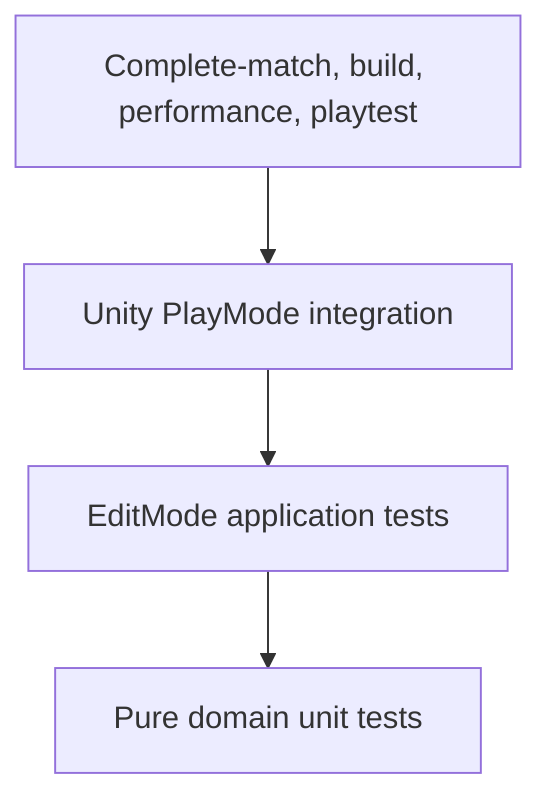

# Testing and Quality Strategy

## Quality objective

EntropyTag must be trustworthy before it is content-rich. Territory ownership, reactions, movement effects,
score, and visible feedback are competitive rules and require stronger validation than decorative systems.

## Current evidence

On 2026-09-10, the full initial baseline passed 180 EditMode and 44 PlayMode tests; the subsequent opponent-
preference refinement passed all 69 bot-policy and 9 competitive-bot PlayMode tests. The Windows development
build succeeded, and the built three-player arena initialized with Direct3D 11.
The follow-up includes ten accelerated live-physics 120-second matches with both bots moving, painting,
and landing hits. Fire selected the other bot 218 times versus the idle human 52 times; only the bot with
two enemies is counted, avoiding a misleading aggregate with the other bot's unavoidable bot-only choices.
One hard Ice stuck recovery occurred and all rounds completed. Horizontal-only progress tracking prevents
jumping in place from concealing a stalled route.
Injected-state scoring cases still cover ties/no-owner results independently of bot behavior.
Other checks cover navigation, recoil protection, enemy/team selection, immutable results, clean restarts,
boundary eligibility/recovery, virtual keyboard/gamepad input, and HUD bounds/non-overlap.
Controlled scene checks cover both human teams with the other bot farther away, while policy tests cover
human fallback, the exact six-meter bias, invalid targets, seeded ties, and unchanged safety/scoring priorities.
The initial baseline's active-score benchmark averaged 0.319 ms per refresh.

These are automated checks, not human UI approval, two-sided balance evidence, or minimum-spec GPU profiling.
The allocation counter reported zero, but score snapshots visibly allocate objects/arrays in source, so that
reading must not be interpreted as allocation-free operation. The broader test goals below remain a roadmap.
See [Match validation and review](15_MATCH_FLOW_SCORING.md#validation-and-review).

## Test pyramid

## Domain tests

Required:

- Every elemental conversion.
- Default conversion behavior.
- Ownership/state separation.
- Score and bank changes.
- Tie and no-owner results.
- Match phase transitions.
- Pressure-boundary calculations.
- Deterministic configuration validation.

Domain tests must not load Unity scenes.

## Application tests

- Commands accepted or rejected by phase.
- Intent ordering.
- Event publication.
- Match reset.
- Seeded randomness.
- Snapshot/query consistency.
- Invalid-state handling.

## PlayMode tests

- Input action binding smoke tests.
- Character movement on territory types.
- Spray contact and visual stamp alignment.
- Camera collision.
- Arena reset.
- Scene bootstrap.
- Bot completes a match.
- Result UI matches authoritative score.

## Performance tests

Capture:

- CPU frame time.
- GPU frame time.
- Territory simulation time.
- Territory visual update time.
- Managed allocation.
- RenderTexture and territory memory.
- Active spray/stamp count.
- Bot decision cost.

Scenarios:

- Idle arena.
- One continuous sprayer.
- Maximum vertical-slice sprayers.
- Dense contested territory.
- Full match reset.
- Development versus release build.

## Visual tests

- Territory palette across lighting conditions.
- Color-vision simulation.
- Reticle visibility.
- Reaction recognition.
- HUD scaling.
- Ring warning readability.
- Camera obstruction cases.

Screenshots are evidence but do not replace interaction testing.

## Build validation

Automated checks should verify:

- Required scenes are in build settings.
- Required configuration assets exist.
- No missing serialized references.
- Test assemblies compile.
- Development and release builds complete.
- Version and commit metadata are embedded.
- Forbidden directories are not packaged.

## Defect severity

| Severity | Definition | Example |
|---|---|---|
| S0 | Data loss, security issue, or release-blocking crash | Build corrupts settings or cannot start |
| S1 | Core match incorrect or frequently unplayable | Score disagrees with territory |
| S2 | Major feature degraded with workaround | Bot stuck in some arena regions |
| S3 | Limited gameplay or presentation defect | VFX timing mismatch |
| S4 | Cosmetic or documentation defect | Minor alignment issue |

## Definition of done

A gameplay task is done only when:

- Acceptance criteria pass.
- Relevant tests exist and pass.
- Failure paths are explicit.
- Performance impact is measured or justified.
- Documentation is updated.
- No new warnings are introduced.
- The related `.todo` completion log contains evidence.

## Playtesting

### Internal

- Frequent focused tests for one question.
- Record build, map, input device, and seed.
- Separate observation from interpretation.

### External

- Do not explain rules unless testing onboarding is not the goal.
- Measure first-match comprehension.
- Ask players to explain reactions and outcomes.
- Record voluntary rematch behavior.
- Avoid collecting unnecessary personal data.

## Release gates

No milestone passes with:

- Known S0 defects.
- Known S1 defects in the target flow.
- Unexplained score divergence.
- Missing licenses.
- Unbounded save incompatibility.
- Unmeasured territory performance.
