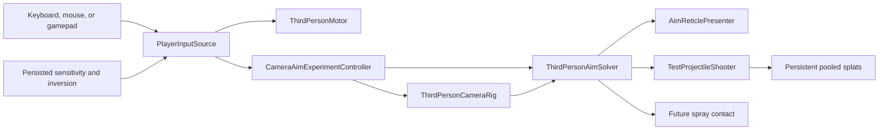

# Player, Camera, and Input Sandbox

## Purpose

The selected movement sandbox evaluates the first playable third-person control stack before production
territory rules, weapons, animation, or final art are added.

Open:

`EntropyTag/Assets/EntropyTag/Scenes/Tests/Sandbox_PlayerMovement.unity`

Then enter Play Mode.

The selected scene starts in free play. [Match Flow and Scoring](15_MATCH_FLOW_SCORING.md) adds an explicit
Enter/Start countdown, a two-minute match, safe-boundary pressure, results, and rematch without replacing
the approved camera or affinity rules. The eight comparison scenes do not contain match flow.

Two mobile fixed-team bots now join explicit matches in the selected scene. They wait during free play,
countdown, and results. Human and bot intent use the same motor/shooter rules; enemy hits cause non-lethal
recoil. See [Competitive Bots](16_COMPETITIVE_BOTS.md).

## Camera comparison scenes

Variant 05, Free Aim Continuous Follow, is the selected foundation. The original eight scenes remain under
`CameraVariants/` as comparison evidence.

1. `Sandbox_Camera_01_CenteredImmediate` - fixed center reticle and immediate camera response.
2. `Sandbox_Camera_02_CenteredSmooth` - fixed center reticle with short camera damping.
3. `Sandbox_Camera_03_CenteredShoulder` - centered camera that shifts over the shoulder while Aim is held.
4. `Sandbox_Camera_04_FreeAimEdgeTurn` - free reticle; camera rotates only outside a central safe zone.
5. `Sandbox_Camera_05_FreeAimContinuousFollow` - free reticle while camera continuously follows input.
6. `Sandbox_Camera_06_ElasticTether` - reticle moves inside a radius and pulls the camera like a spring.
7. `Sandbox_Camera_07_SoftZoneRecenter` - free reticle with edge turn that recenters during rotation.
8. `Sandbox_Camera_08_CenteredCinematicSpring` - fixed center reticle with intentionally heavier camera lag.

Every scene uses the same expanded movement gym, movement mechanics, paint-splat shooter, and thin cuboid
torso with a sphere head. Only camera/crosshair behavior changes.

The movement gym contains a larger floor, climb wall, raised platform, ramp, narrow beam, graduated steps,
and a low-clearance slide tunnel.

## Controls

| Intent | Keyboard and mouse | Gamepad |
|---|---|---|
| Move | `WASD` | Left stick |
| Turn camera / aim | Mouse movement | Right stick |
| Jump / wall jump | `Space` | A / Cross |
| Slide | `Left Ctrl` | B / Circle |
| Aim | Right mouse button | Left trigger |
| Fire paint projectiles | Left mouse button | Right trigger |
| Choose Ice / Fire in free play or results | `Tab` | Y / Triangle |
| Clear free-play paint / restart match | `R` | View / Select |
| Start match / rematch in selected scene | `Enter` | Start |
| Reserved pause intent (no pause UI yet) | `Escape` | Start binding also exists; currently confirms matches |

Hold movement toward the climb wall to climb it. Jumping while climbing pushes the player away from the wall.
Fire launches pooled test projectiles through the shared aim solution. Designated planar-face impacts stamp authoritative
Ice/Fire/Mist territory and leave simple colored splats; non-paintable geometry receives only the shape splat.

## Runtime flow

## Components

- `PlayerInputSource` binds the shared Input Action Asset once and reads movement, look, aim, fire, jump,
  slide, element switching, territory reset, and match confirmation without per-frame action lookup.
- `ThirdPersonMotor` uses `CharacterController` for camera-relative acceleration, deceleration, gravity,
  grounded movement, jumping, wall climbing and wall jumping, sliding with reduced collision height,
  rotation, external impulses, and speed modifiers.
- `CameraAimExperimentController` contains eight isolated presets and serializes the selected mode into each
  scene. It supports centered, shoulder, free-reticle, edge-zone, tether, recentering, and spring behavior.
- `ThirdPersonCameraRig` applies orbit look, pitch limits, and sphere-cast collision without shifting into a
  shoulder view.
- `ThirdPersonAimSolver` raycasts through the viewport position selected by the camera experiment and exposes
  one `AimSolution`.
- `AimReticlePresenter` displays the reticle and contact marker from that same solution.
- `TestProjectileShooter` prewarms reusable projectile and splat pools, fires toward the shared aim solution,
  and leaves a simple persistent splat at each collision without allocating a new projectile per shot.
- `PlayerSettingsStore` persists versioned mouse sensitivity, gamepad sensitivity, and vertical inversion in
  local `PlayerPrefs`.
- `PlayerSandboxDiagnostics` records frame allocation and main-thread timing counters.

## Validation

Automated validation covers:

- Full initial baseline (2026-09-10): 180 EditMode and 44 PlayMode tests passed. Subsequent opponent-preference
  evidence is in [Competitive Bots](16_COMPETITIVE_BOTS.md#verification-and-remaining-review).
- Keyboard/mouse and gamepad schemes are present.
- Camera collision prevents the camera remaining behind the sandbox wall.
- Motor impulse and speed-modifier hooks operate.
- Settings survive a local save/load cycle.
- Test projectiles activate from the pool and travel along the shared aim solution.
- Jump, wall climb, wall jump, and reduced-height slide behavior operate in the generated movement gym.
- Projectile impacts create persistent pooled splats.
- Paintable floor, wall, ramp, and platform impacts update a CPU logical face field and its matching planar
  visual texture.
- The HUD shows selected element, Ice/Fire coverage and bank, Mist/Neutral cells, and sampled player territory.
- Firing does not cause the camera collision rig to collapse toward the player.
- A 300-iteration warm player loop allocates zero managed bytes and averages below 1 ms per isolated update.
- Windows development build succeeds and explicitly excludes all eight comparison scenes.

Variant 05 is selected. The combined interactive playtest of its camera, movement gym, jump, wall climb,
slide, and paint-splat behavior was accepted on 2026-08-21.

Generic Input System `<Gamepad>` bindings cover both Xbox-style and PlayStation-style controllers; any
platform-specific glyphs or naming belong to the later UI/accessibility TODO.

## Current limitations

- Placeholder thin cuboid torso, sphere head, floor, wall, target, reticle, and lighting only.
- No animation, sprinting, production combat, continuous spray stream, pause flow, rebinding UI, or settings UI.
- Planar territory, affinity, timer, safe boundary, and prototype score/result HUD are implemented.
  Two competitive bots are implemented; match/bot play is awaiting hands-on review, and production
  presentation remains unfinished.
- Falling below the sandbox returns the player to the marked spawn pad with movement state cleared.
- Input tuning values are persisted by the service but not yet exposed through a menu.
- The sandbox is a technical proof, not a production arena.
