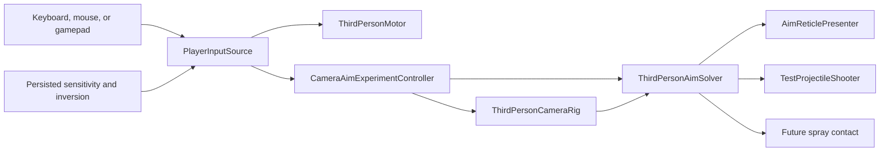

# Player, Camera, and Input Sandbox

## Purpose

Eight comparison sandboxes evaluate the first playable third-person control stack before territory rules,
weapons, animation, or final art are added.

Open scenes from:

`EntropyTag/Assets/EntropyTag/Scenes/Tests/CameraVariants/`

Then enter Play Mode.

## Camera comparison scenes

1. `Sandbox_Camera_01_CenteredImmediate` - fixed center reticle and immediate camera response.
2. `Sandbox_Camera_02_CenteredSmooth` - fixed center reticle with short camera damping.
3. `Sandbox_Camera_03_CenteredShoulder` - centered camera that shifts over the shoulder while Aim is held.
4. `Sandbox_Camera_04_FreeAimEdgeTurn` - free reticle; camera rotates only outside a central safe zone.
5. `Sandbox_Camera_05_FreeAimContinuousFollow` - free reticle while camera continuously follows input.
6. `Sandbox_Camera_06_ElasticTether` - reticle moves inside a radius and pulls the camera like a spring.
7. `Sandbox_Camera_07_SoftZoneRecenter` - free reticle with edge turn that recenters during rotation.
8. `Sandbox_Camera_08_CenteredCinematicSpring` - fixed center reticle with intentionally heavier camera lag.

Every scene uses the same floor, wall, target, movement, pooled sphere shooter, and thin cuboid torso with a
sphere head. Only camera/crosshair behavior changes.

## Controls

| Intent | Keyboard and mouse | Gamepad |
|---|---|---|
| Move | `WASD` | Left stick |
| Turn camera / aim | Mouse movement | Right stick |
| Aim | Right mouse button | Left trigger |
| Fire test spheres | Left mouse button | Right trigger |
| Pause intent | `Escape` | Start |

Fire launches pooled test spheres through the shared aim solution. Territory spray and pause flow belong to
later TODOs.

## Runtime flow

## Components

- `PlayerInputSource` binds the shared Input Action Asset once and reads movement, look, aim, and fire without
  per-frame action lookup.
- `ThirdPersonMotor` uses `CharacterController` for camera-relative acceleration, deceleration, gravity,
  grounded movement, rotation, external impulses, and speed modifiers.
- `CameraAimExperimentController` contains eight isolated presets and serializes the selected mode into each
  scene. It supports centered, shoulder, free-reticle, edge-zone, tether, recentering, and spring behavior.
- `ThirdPersonCameraRig` applies orbit look, pitch limits, and sphere-cast collision without shifting into a
  shoulder view.
- `ThirdPersonAimSolver` raycasts through screen center and exposes one `AimSolution`.
- `AimReticlePresenter` displays the reticle and contact marker from that same solution.
- `TestProjectileShooter` prewarms a reusable sphere pool and fires from the player muzzle toward that same
  solution without allocating a new projectile for every shot.
- `PlayerSettingsStore` persists versioned mouse sensitivity, gamepad sensitivity, and vertical inversion in
  local `PlayerPrefs`.
- `PlayerSandboxDiagnostics` records frame allocation and main-thread timing counters.

## Validation

Automated validation covers:

- EditMode: 4 passed, 0 failed.
- PlayMode: 7 passed, 0 failed.
- Keyboard/mouse and gamepad schemes are present.
- Camera collision prevents the camera remaining behind the sandbox wall.
- Motor impulse and speed-modifier hooks operate.
- Settings survive a local save/load cycle.
- Test projectiles activate from the pool and travel along the shared aim solution.
- A 300-iteration warm player loop allocates zero managed bytes and averages below 1 ms per isolated update.
- Windows development build succeeds and explicitly excludes all eight comparison scenes.

The final acceptance gate is comparative: test all eight scenes at roughly 60 FPS and identify the preferred
model plus any desired tuning.

Generic Input System `<Gamepad>` bindings cover both Xbox-style and PlayStation-style controllers; any
platform-specific glyphs or naming belong to the later UI/accessibility TODO.

## Current limitations

- Placeholder thin cuboid torso, sphere head, floor, wall, target, reticle, and lighting only.
- No animation, jumping, sprinting, real combat, spray, pause flow, rebinding UI, or settings UI.
- Test spheres have no damage, ownership, elemental behavior, impact feedback, or gameplay scoring.
- Input tuning values are persisted by the service but not yet exposed through a menu.
- The sandbox is a technical proof, not a production arena.
