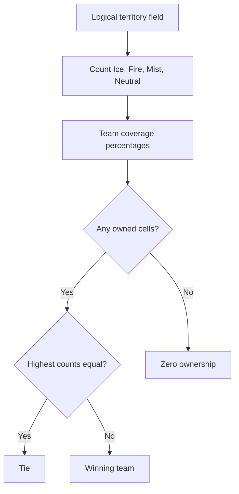

# Domain Rules

## Purpose

The Domain assembly defines deterministic first-slice rules without Unity scenes, rendering, physics, input,
or other engine dependencies. Unity adapters will later translate world-space spray contacts into these
logical commands.

## First-slice contract

- Teams: Ice (`TeamId(1)`) and Fire (`TeamId(2)`).
- Cell states: Neutral, Ice, Fire, and Mist.
- Territory authority: CPU `TerritoryField`.
- Visual GPU paint: projection only; never gameplay truth.
- Score: owned logical cells divided by all active logical cells.
- Bank: two points for neutralizing enemy territory and one point for claiming resulting Mist.
- Bank is displayed but cannot be spent in the first slice.
- Match duration: 120 seconds.
- Outcome: highest territory ownership wins; equal ownership is a tie; no owned cells is zero ownership.

## Reaction table

| Existing state | Applied element | Result | Owner | Bank condition |
|---|---|---|---|---|
| Neutral | Ice | Ice | Applying Ice team | None |
| Neutral | Fire | Fire | Applying Fire team | None |
| Ice | Ice | Ice | Applying Ice team | None |
| Fire | Fire | Fire | Applying Fire team | None |
| Ice | Fire | Mist | None | 2 when enemy Ice was neutralized |
| Fire | Ice | Mist | None | 2 when enemy Fire was neutralized |
| Mist | Ice | Ice | Applying Ice team | 1 when claiming opposing-team Mist provenance |
| Mist | Fire | Fire | Applying Fire team | 1 when claiming opposing-team Mist provenance |

Mist retains `PreviousOwner` provenance while current ownership is neutral. This prevents a team from earning
claim bank by repainting Mist created from its own territory.

Water is intentionally unsupported in the first-slice resolver. A team attempting to apply an element other
than its configured element fails explicitly.

## Stamp flow

```mermaid
flowchart LR
    accTitle: Deterministic territory stamp flow
    accDescr: A validated team applies its configured element to unique logical coordinates, the reaction table resolves each cell, and the command returns changed cells and bank without using Unity.

    command[Stamp coordinates, element, team]
    validate[Validate team and element]
    unique[Deduplicate coordinates]
    current[Read current cell]
    resolve[Resolve data-driven reaction]
    write[Write resulting cell]
    bank[Accumulate bank award]
    result[StampResult]

    command --> validate --> unique --> current --> resolve
    resolve --> write --> bank --> result
```

`TerritoryField.ApplyStamp` rejects out-of-bounds coordinates, processes each coordinate at most once per
stamp, and returns attempted cells, changed cells, and bank awarded. `Reset` returns every cell to Neutral.

## Coverage and outcome

Neutral and Mist cells remain visible in the denominator, so reaction territory cannot silently disappear
from scoring space. Bank never breaks a first-slice territory tie.

## Match phases

| Phase | Elapsed time |
|---|---:|
| Waiting | Before start |
| Opening | 0-24 seconds |
| Contest | 24-78 seconds |
| Compression | 78-115 seconds |
| Resolution | 115-120 seconds |
| Complete | 120 seconds |

Thresholds are validated data, not hard-coded behavior inside callers. `MatchClock` rejects negative or
non-finite time deltas and cannot advance before `Start`.

## Determinism and validation

- `TeamId` and `PlayerId` reject non-positive values.
- First-slice configuration requires one Ice team and one Fire team with distinct IDs.
- The resolver requires all eight reaction-table entries with the exact expected result and award contract.
- Invalid cell ownership combinations fail during construction.
- `SeededRandomSource` uses a stable xorshift sequence for repeatable bots and simulations.
- The Domain assembly has `noEngineReferences: true` and no Unity API references.

## Automated evidence

- EditMode: 24 passed, 0 failed.
- PlayMode regression: 10 passed, 0 failed.
- Windows development build succeeded.
- A fixed 2x2 stamp sequence repeats with Ice 1, Fire 2, Neutral 1, Mist 0, and Fire bank 3.

Domain tests run without loading a gameplay scene. Territory Painting will be responsible for world-to-cell
mapping and keeping the visual GPU representation aligned with this authoritative model.

The developer approved this rule package on 2026-08-21.
