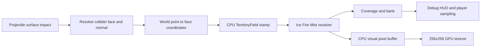

# Territory Painting

## Purpose

The selected player sandbox now proves deterministic territory across designated floors, walls, ramps,
platforms, beams, steps, and tunnel geometry. Visuals, bank, coverage, and player sampling derive from the
committed Domain Rules.

Open:

`EntropyTag/Assets/EntropyTag/Scenes/Tests/Sandbox_PlayerMovement.unity`

Enter Play Mode and use:

| Intent | Keyboard and mouse | Gamepad |
|---|---|---|
| Fire paint projectile | Left mouse | Right trigger |
| Switch Ice / Fire | `Tab` | Y / Triangle |
| Reset all territory | `R` | View / Select |

The upper-right HUD uses dark green text with a subtle black outline and displays smoothed current FPS,
selected element, Ice and Fire coverage, team bank, Mist and Neutral cell counts, and the logical state
sampled beneath the player. Ice percentage is cyan, Fire percentage is orange, and the complete
`Standing on` line changes between green, cyan, orange, and pink for Neutral, Ice, Fire, and Mist.

## Authority and visual projection

Each planar face owns a bounded logical grid and matching texture projection. The 64x64 floor grid remains
the largest logical surface, with a 256x256 RGBA32 texture; smaller faces use adaptive grids and 64- or
128-pixel textures. Score, bots, reactions, and movement queries never sample those textures.

## Surface mapping

Every designated collider has explicit planar `TerritorySurface` faces registered with
`TerritorySurfaceRegistry`. Impact collider, point, and normal resolve the exact face. World points are then
transformed into that face's local XY coordinates and converted into bounded logical coordinates.

The runtime creates a four-vertex quad whose UV coordinates exactly match local XY, avoiding Unity cube UV
atlases that previously displaced colored square tiles away from their impacts. Circular world-space stamps
account for each face's width and height and produce a reusable coordinate list. The Domain field
deduplicates coordinates through generation markers rather than allocating a new set for every stamp.

## Ice, Fire, and Mist

- Ice on Neutral produces Ice ownership.
- Fire on Neutral produces Fire ownership.
- Ice on Fire or Fire on Ice produces ownerless Mist and awards enemy-neutralization bank.
- Applying an element to opposing-team Mist claims it and awards reaction-claim bank.
- Reclaiming Mist derived from the same team awards no bank.

The visual colors are cyan Ice, orange Fire, and pale violet Mist. Neutral mask pixels are transparent, so
the lit gray manga-style structure remains visible beneath the paint system.

## Manga-style structure readability

Every generated arena structure uses one shared `#FCFCFA` lit material and one shared black outline
material. A slightly enlarged collider-free copy of the source mesh renders backfaces only, producing a bold
silhouette without per-frame geometry generation or per-object material instances.

Territory uses a minimal alpha-clipped URP shader. Neutral pixels are discarded; painted pixels render
opaque above the structure. This keeps form shading and outlines visible while color remains readable on top.
The cost is one additional outline draw per structure plus the already-required face overlays. The HUD FPS
counter provides immediate hands-on regression evidence; target-hardware profiling remains a later gate.

## Reset and sampling

Reset clears:

- Logical cells on every registered face.
- Every face's visual pixel buffer and uploaded texture.
- Ice and Fire bank totals.
- Every pooled shape splat in the test shooter.

Player territory sampling raycasts downward, resolves the hit face, converts the hit point to a logical
coordinate, and reads `TerritoryCell` directly. No GPU readback is involved.

## CPU/GPU split decision

Two broad approaches were considered:

1. CPU logical authority with a derived GPU visual mask.
2. GPU mask authority or GPU-first coverage mirrored back to CPU.

The first approach is retained because it provides deterministic tests, score, bots, future network
authority, and player sampling without readback. The current proof updates a CPU RGBA buffer and submits one
texture upload at most once per frame. A later shader, RenderTexture, or compute path can replace the visual
projection without changing logical commands.

## Bounded resources and provisional budgets

For the largest registered surface:

- Logical grid: 64x64, or 4,096 cells.
- Visual texture: 256x256 RGBA32.
- Estimated persistent CPU storage: at most 768 KiB, including the managed pixel buffer and readable
  texture's estimated native CPU copy.
- GPU texture storage: at most 256 KiB; smaller faces use 64- or 128-pixel textures.
- Coordinate list capacity grows only to the largest observed brush and is then reused.
- Projectiles and shape splats remain fixed-size pools.

The PlayMode benchmark warms the system, applies 600 stamps, and requires:

- Average logical and CPU-visual stamp time below 1 ms.
- Managed allocation no greater than 1 KiB across the measured sequence.
- One 256x256 texture upload submission below 3 ms.

These are automated proof thresholds on the development machine, not final target-hardware GPU profiling.
The accepted GTX 1060/RX 580-class validation remains part of later performance work.

## Automated evidence

- EditMode: 24 passed, 0 failed.
- PlayMode: 18 passed, 0 failed.
- Deterministic Domain stamp sequence remains covered.
- Logical state and visual color align through Ice, Mist, and Fire transitions.
- Reset leaves no logical, visual, bank, or pooled-splat residue.
- Player sampling returns logical territory without texture access.
- Projectile impacts stamp authoritative territory.
- Off-center rendered colors align with the corresponding logical world coordinates.
- Vertical wall impacts resolve and paint the correct face.
- Structures share one base material and one outline material, and every generated structure creates its
  outline without colliders or shadows.
- HUD output begins with a smoothed FPS counter.
- Falling below the arena returns the player to the visibly labeled spawn pad.
- The spawn label is sized to remain inside the pad and faces upward toward the gameplay camera.
- Element percentages and the complete standing-state line use state-specific rich-text colors.
- Sustained stamping passes the provisional time, allocation, and memory thresholds.
- Windows development build succeeds and excludes sandbox scenes.

## Current limitations

- Texture edges are intentionally blocky and use debug colors.
- Outlines are silhouette-based rather than production ink lines on every internal edge.
- Curved and arbitrary production meshes do not yet have authored paint projections; the current proof
  covers generated planar faces.
- No friendly/hostile movement effects, bots, shrinking boundary, match timer, or production HUD yet.
- No target-hardware GPU capture has been performed.
