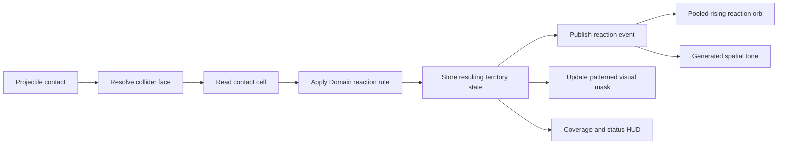
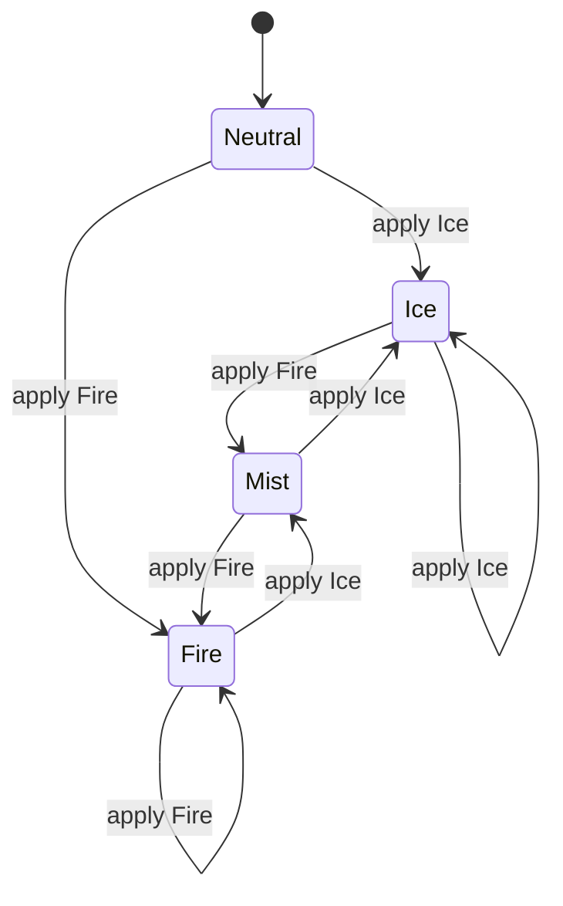
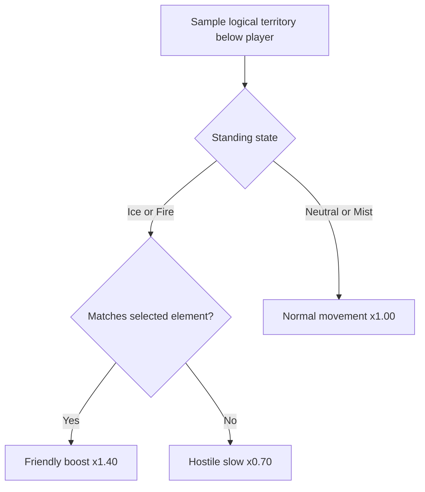

# Element Reactions

## Purpose

The first playable reaction slice makes Ice, Fire, and Mist deterministic, readable without color alone,
and mechanically meaningful. It builds on the CPU-authoritative territory system rather than introducing a
second reaction simulation.

Open:

`EntropyTag/Assets/EntropyTag/Scenes/Tests/Sandbox_PlayerMovement.unity`

Shoot one element onto territory owned by the other element. The contested cells become Mist, a pink
crosshatched reaction orb rises and expands from the authoritative hit point, and a short audible chime plays. Shoot the
Mist again to claim it. For sandbox testing, the selected element acts as the player's temporary team:
matching territory boosts movement, opposing territory slows movement, and Neutral or Mist remains normal.

## Reaction flow

`TerritoryField` remains the only authority. `TerritoryReactionEvent` is emitted after the contact cell
changes and carries the surface, world contact point and normal, previous and current state, applied element,
bank award, and reaction kind. Feedback consumes the event; it does not decide gameplay.

## Deterministic state transitions

The rules and bank calculation are inherited from the engine-free Domain assembly:

- Neutralizing enemy territory into Mist awards 2 provisional bank points per changed cell.
- Claiming Mist derived from opposing territory awards 1 point.
- Recovering Mist derived from the same team awards 0 points.

## Readability without color

The territory texture alpha channel stores a presentation tag rather than opacity:

| State | Color | Pattern | Alpha tag |
|---|---|---|---|
| Neutral | Structure base remains visible | None | `0` |
| Ice | Cyan | Diagonal stripes | `64` |
| Fire | Orange | Dots | `128` |
| Mist | Pink | Crosshatch | `192` |

The URP territory shader converts those tags into procedural patterns in face UV space and outputs painted
pixels opaque. No pattern textures, per-cell GameObjects, or GPU readback are required. The pattern choice and
colors originate in `FirstSliceElementReactions.asset`; scene regeneration preserves developer tuning when
the asset already exists.

## Territory movement affinity

The movement configuration preserves the intended prototype relationship without inheriting its contradictory
duplicate Fire-on-Mist entry:

- Matching primary territory: `1.40x`.
- Opposing primary territory: `0.70x`.
- Neutral or Mist: `1.00x`.

`TerritoryMovementController` applies the current multiplier immediately from the logical sampled cell.
The HUD displays `FRIENDLY BOOST`, `HOSTILE SLOW`, or `Normal`; a green or pink foot marker telegraphs active
boost/slow states. The movement status uses its own UI row so no other debug text receives a background.
Friendly boost has a transparent background and selected-team-colored text. Hostile slow uses the hostile
territory color as its background and the selected team color as its foreground. That dedicated row sits
below the full debug text and sizes itself to the rendered status plus compact padding, keeping the reset
instruction visible and avoiding a full-width color bar. In the production game, player affinity will come
from the player's fixed team rather than the sandbox element-switch control.

## Bounded feedback

`ElementReactionFeedback` owns six reusable sphere visuals and six colocated `AudioSource` components.
The pool is created lazily on the first contested reaction. A generated 520 Hz, 0.12-second tone avoids an
external placeholder asset, and each pulse expires after the configured 0.6 seconds. Repeated reactions reuse
slots instead of instantiating feedback per impact.

## Automated evidence

- EditMode: 24 passed, 0 failed.
- PlayMode: 20 passed, 0 failed.
- Ice, Fire, and Mist configuration and pattern tags are verified.
- Contested world stamps publish reaction data at the authoritative contact.
- Reaction feedback creates one fixed six-slot pool with a generated audio placeholder.
- Friendly, hostile, Mist, and Neutral movement modifiers match the configured affinity table.
- The Windows development build succeeds and continues to exclude sandbox scenes.
- Existing territory alignment, wall painting, allocation budget, movement, camera, HUD, and respawn tests
  remain passing.

## Hands-on review

1. Open `Sandbox_PlayerMovement.unity` and enter Play Mode.
2. Paint a visible Ice patch.
3. Switch to Fire and shoot the Ice patch twice.
4. Confirm the first Fire hit creates patterned Mist with a rising pink orb and audible chime.
5. Confirm the second Fire hit claims the Mist as dotted Fire.
6. While Ice is selected, confirm Ice boosts movement, Fire slows movement, and Mist is normal.
7. Switch to Fire and confirm Fire boosts movement, Ice slows movement, and Mist remains normal.
8. Confirm friendly boost has selected-team-colored text with no background.
9. Confirm only hostile slow has a hostile-territory-colored background and selected-team-colored text.

The final comprehension gate is subjective: after observing the sequence twice, the developer should be able
to predict that an opposing hit creates Mist and the next elemental hit claims it.

## Current limitations

- Feedback uses generated primitive geometry and a synthesized tone, not production VFX or authored audio.
- Selected element temporarily represents player team affinity only inside this developer sandbox.
- Status sampling is local and offline; network authority remains deferred.
- Pattern scale is procedural and not yet exposed as configuration.

## Review result

The developer approved the final reaction readability, selected-team affinity behavior, foot telegraphs, and
isolated content-sized terrain-status HUD row on 2026-08-28.
