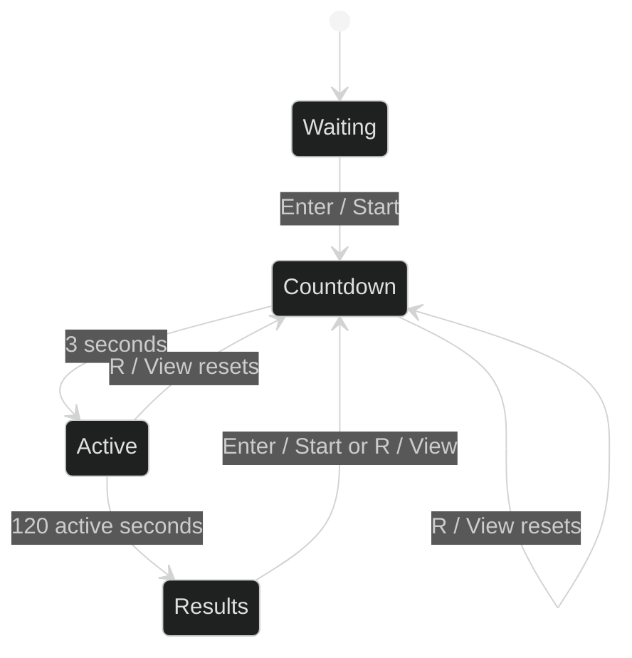
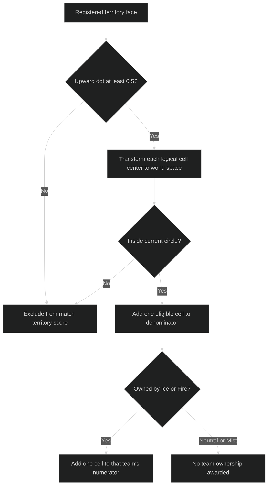
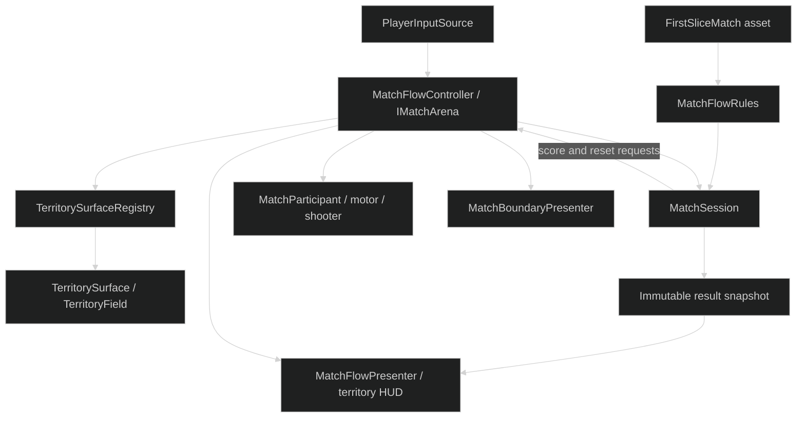
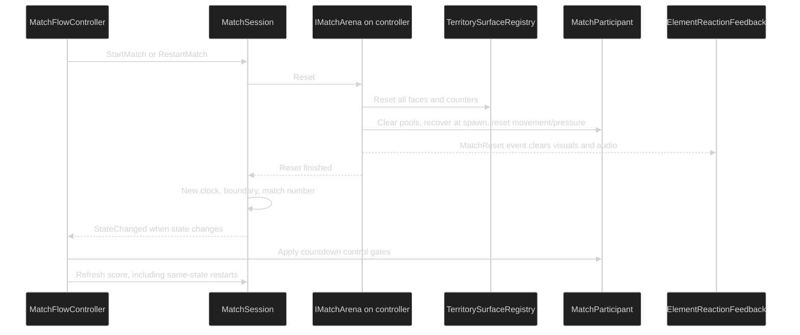

# Match Flow and Scoring

## Scope

This milestone connects the existing territory rules to a complete local match lifecycle. It began as a solo
proof and now includes the developer-authorized human plus fixed Ice/Fire competitive bots. See
[Competitive Bots](16_COMPETITIVE_BOTS.md). It does not claim that the complete vertical slice, authored
arena, production menus, combat presentation, or balancing are finished.

The approved player-movement scene remains the main developer entry:

`EntropyTag/Assets/EntropyTag/Scenes/Tests/Sandbox_PlayerMovement.unity`

It opens in free play, preserving movement, camera, element switching, painting, and the existing HUD.
Starting a match clears free-play paint instead of carrying an unfair head start into scoring.
Bots remain idle in free play, then move, paint, and fight during the active match.

A buildable copy of the same movement gym lives at:

`EntropyTag/Assets/EntropyTag/Scenes/Gameplay/Arena_FirstSlice.unity`

`Bootstrap` loads that scene additively and makes it active. The official Windows build includes Bootstrap
and this arena, while continuing to exclude the player sandbox and all eight camera comparison scenes.
The comparison scenes remain free-play experiments without the match UI or pressure controller.

## Controls and lifecycle

| State | Enter / gamepad Start | R / View or Select | Tab / Y or Triangle |
|---|---|---|---|
| Free play | Start a match | Clear free-play paint | Choose Ice or Fire |
| Countdown | No additional action | Restart countdown | Locked |
| Active match | No additional action | Restart the match | Locked |
| Results | Start a clean rematch | Start a clean rematch | Choose the next match's team |

Start currently confirms a match, not pause. Pause/settings UI remains a separate milestone.

The three-second countdown is separate from the 120-second match. Movement and firing are disabled during
countdown and results; camera look remains available. Team choice is fixed during countdown and active play.
This changes only the explicit match mode, not the approved free-play synergy testing.
The shared HUD scales from a 1600x900 reference with an expanding canvas, keeping the variant label,
match header, existing green debug block, results, and bottom instructions in separate regions.
The camera experiment still positions its free reticle in screen space.

## Timing and pressure

| Phase | Active elapsed time | Boundary |
|---|---|---|
| Opening | 0-24 seconds | Radius 20 |
| Contest | 24-78 seconds | Radius 20; warning begins at 70 seconds |
| Compression | 78-115 seconds | Linear shrink from radius 20 to radius 8 |
| Resolution | 115-120 seconds | Radius 8 |
| Results | After 120 seconds | Final boundary and frozen score |

The boundary is a vertical circular region centered at world X/Z `(0, 0)`, not a terrain height restriction.
Its ground/upper rings and eight thin vertical posts show the current edge. A smaller preview ring shows
the final area from countdown onward. The HUD announces the approach of compression, active shrinking,
and an individual player's outside-boundary grace period.

All participants use the same radius and grace rule, independent of element. A player outside the ring has
two seconds to return. Otherwise the player returns to the configured safe spawn, with velocities and
transient projectiles cleared. This is non-lethal recovery: no health, death, elimination score, or bank loss
is introduced. Recovery spawns must lie within the final boundary.

The circles are fixed-size LineRenderer resources sharing one small unlit shader/material. Position buffers
are reused; no per-frame mesh or material creation and no fullscreen post-processing pass are required.
This is bounded implementation cost, not a guarantee of zero FPS impact on all hardware.

## What counts toward the result

- Only designated upward-facing territory faces count: floors, ramp tops, steps, and platform tops.
- A face qualifies when its normal has an upward dot product of at least `0.5`.
- A cell counts while its world-space center is inside the current circular boundary.
- Walls and other vertical faces remain paintable but contribute no match-winning territory.
- Each eligible logical cell has equal score weight. This is not a physical-square-meter calculation.
- Neutral and Mist remain in the denominator.
- Outer territory stops contributing as the boundary contracts; its stored paint is not erased.
- Active-match projectile impacts outside the boundary are rejected, and brushes clip each stamped cell
  to the boundary rather than painting/banking across its edge.

The free-play debug HUD continues to display coverage over all registered faces. Once a match starts, that
same HUD displays eligible active-area coverage, avoiding disagreement with the result screen.

Bank and reaction counts record earned activity across the match, including paintable walls. Already
earned bank is not removed when an outer region becomes inactive. Bank remains unspendable and **never**
breaks a territory tie.

Result data records owned/eligible cells, percentages, Neutral/Mist counts, both banks, and the number of
cells converted into and out of Mist by each team. These are actual deduplicated cell transitions, not
counts of feedback orbs or projectile events.

## Runtime architecture

`MatchSession` lives in the engine-free Application assembly. It handles countdown overflow, every crossed
phase in order, completion exactly once, and independent match numbers. Its arena interface supplies reset
and score queries without introducing a Unity dependency into the rules.

`MatchFlowController` adapts that session to serialized participants, input, territory, and Unity time.
Live score snapshots refresh at five times per second, rather than scanning every cell every frame.
The final score is captured at the final boundary and remains immutable even if later arena state changes.

`MatchParticipant` handles control gates, recovery, reset, and shared non-lethal hits; bot decisions live
separately in `BotTactics` and `TerritoryBotController`.
The existing affinity controller remains responsible for `1.40x` friendly normal locomotion, `0.70x`
hostile normal locomotion, and `1.00x` Neutral/Mist behavior.

## Clean rematch

Starting or restarting a match resets logical paint on every registered face, derived textures, bank,
reaction counters, all pooled projectiles and splats, reaction feedback/audio, participant positions,
velocities, slide/climb state, movement affinity, pressure timers, and the match clock/boundary.
Bot routes, goals, random sources, intent, and activity counters reset too. Navigation data is reused.

Completing a match disables shooting and recycles remaining projectiles so an in-flight shot cannot alter
the result after the buzzer. Result snapshots contain values, not references to mutable territory arrays.
The previous result remains stable while the next match begins.

### Implementation entry points

| Layer | Source |
|---|---|
| Timing and circular boundary | [`MatchFlowRules.cs`](../EntropyTag/Assets/EntropyTag/Scripts/Domain/MatchFlowRules.cs) |
| Lifecycle and arena contract | [`MatchSession.cs`](../EntropyTag/Assets/EntropyTag/Scripts/Application/MatchSession.cs) |
| Frozen score/result values | [`MatchScoreSnapshot.cs`](../EntropyTag/Assets/EntropyTag/Scripts/Application/MatchScoreSnapshot.cs) |
| Unity orchestration | [`MatchFlowController.cs`](../EntropyTag/Assets/EntropyTag/Scripts/Unity/MatchFlowController.cs) |
| Participant reset and recovery | [`MatchParticipant.cs`](../EntropyTag/Assets/EntropyTag/Scripts/Unity/MatchParticipant.cs) |
| Active score aggregation | [`TerritorySurfaceRegistry.cs`](../EntropyTag/Assets/EntropyTag/Scripts/Unity/TerritorySurfaceRegistry.cs) |
| Scene/HUD generation | [`MatchFlowSetup.cs`](../EntropyTag/Assets/EntropyTag/Scripts/Editor/MatchFlowSetup.cs) |

## Authoring and regeneration

`Assets/EntropyTag/Settings/Tuning/FirstSliceMatch.asset` owns countdown, match duration and phase thresholds,
boundary center/radii, warning lead time and outside grace. Invalid timing/radii fail explicitly.
Regeneration preserves an existing asset's tuning.

Use **EntropyTag -> Setup -> Create Match Flow Scenes**, or batch method
`EntropyTag.Editor.MatchFlowSetup.Apply`, with Unity not simultaneously open elsewhere.
It regenerates only the selected sandbox and playable arena, not the eight approved comparison scenes.

Runtime shaders have explicit serialized asset references, so the standalone build does not rely solely
on an editor-only successful `Shader.Find` lookup.

## Validation and review

Automated evidence on 2026-09-10; full baseline counts precede the targeted bot-opponent refinement:

| Check | Result |
|---|---|
| Full baseline EditMode suite | 180 passed, 0 failed |
| Full baseline PlayMode suite | 44 passed, 0 failed |
| Bot-targeting follow-up | 69 policy cases and 9 competitive-bot PlayMode tests passed, including ten live rounds |
| Repeated lifecycle | Ten injected-state rounds plus ten live-physics bot rounds; each has 120 active seconds |
| Windows development build | Succeeded; Bootstrap and buildable arena included |
| Standalone startup | Three-player arena ready in free play with Direct3D 11; no runtime/shader errors |
| Baseline active score refresh | 0.319 ms average across 100 warm refreshes; below the 2 ms proof threshold |
| HUD | Text bounds, screen containment, and non-overlapping major panels passed |

Tests also cover countdown overflow without spending the pressure grace period, input/control gates,
virtual keyboard/gamepad start/restart/rematch, clipped stamps, symmetric outside recovery, mid-match
restart, phase/result event ordering, frozen results, and Bootstrap-to-arena startup.

Evidence is under the ignored `EntropyTag/TestResults/` and `EntropyTag/Builds/` directories:
`EditMode-results.xml`, `PlayMode-results.xml`, `Bots-setup.log`, `Bots-player-d3d11.log`, and
`Windows-development.log`. The earlier `-nographics` smoke also reached startup, but its null graphics device
reported unsupported shaders; it is not rendering evidence. The later graphics-enabled smoke is the useful
shader/startup check. All owned smoke-test player processes were stopped afterward.

The managed-allocation counter reported zero, but score snapshots allocate objects and arrays in source.
That counter reading is not proof of allocation-free execution. Bounded snapshots refresh at 5 Hz rather
than every frame. Neither the CPU benchmark nor startup smoke is a 60 FPS/minimum-hardware guarantee or a
visual readability approval.

Hands-on review remains required before TODO 06 can be marked DONE or committed:

1. Open the selected player sandbox; confirm free play still feels unchanged.
2. Choose a team, press Enter/Start and observe the countdown and clean start.
3. Paint during the match; confirm the timer, active coverage and fixed team identity.
4. Observe the warning and contraction, and deliberately step outside to check recovery.
5. Confirm the final result, then rematch without reloading the scene.
6. Restart once during active play and confirm no old paint, shots, feedback, bank or timer survives.

The two bots now provide real contested play. Your team has two actors against one, so neither the setup nor
automated win counts establish competitive balance. Final authored arena scoring eligibility, production
UI, target-hardware GPU profiling, audio warnings and pause remain later work.
