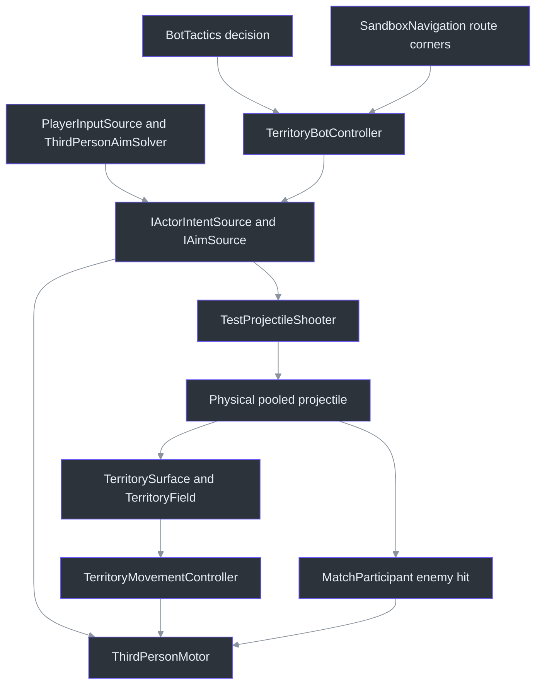
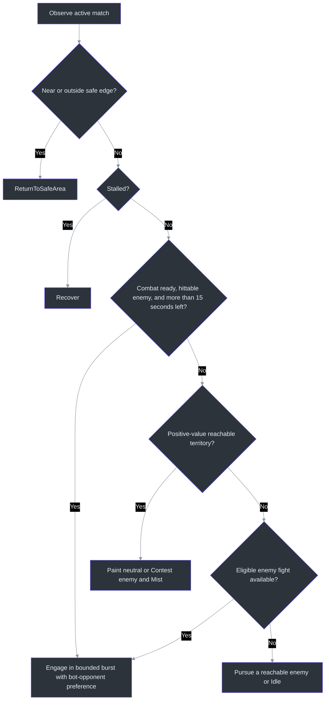
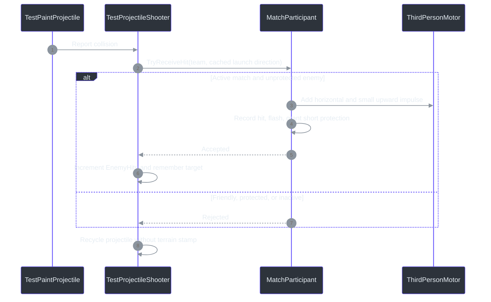

# Competitive Bots

## Why this milestone exists

A timer and a result screen establish match rules, but a solo actor cannot demonstrate contested play.
This milestone adds two mobile opponents to the existing movement gym so the developer can experience
territory being taken back, enemies interrupting movement, and the shrinking circle changing priorities.
It replaces the earlier parked stationary-bot proposal, following the developer's explicit request on
2026-09-10 for bots that attack enemies and strive to win.

These are small, win-oriented heuristic bots, not production tactical AI. They seek useful territory,
fight in bounded bursts, return toward safety, and prefer scoring over fights near the finish.
Victory still comes from eligible territory, not kills, hits, or bank.
See [Match Flow and Scoring](15_MATCH_FLOW_SCORING.md).

## Start a contested match

Open `EntropyTag/Assets/EntropyTag/Scenes/Tests/Sandbox_PlayerMovement.unity`, enter Play Mode, then press
**Enter / gamepad Start**. The bots wait during free play and countdown, compete during the active round,
and stop at results. They are also present in the buildable `Arena_FirstSlice`.

| Actor | Team | Enemy targets |
|---|---|---|
| Human | Ice or Fire, selected with Tab / Y outside an active round | Opposing bot |
| Ice Bot | Always Ice | Prefers Fire Bot; human remains eligible when human is Fire |
| Fire Bot | Always Fire | Prefers Ice Bot; human remains eligible when human is Ice |

Three actors and two teams necessarily mean **the human's side has two actors against one**. This is not
a three-team free-for-all or a balanced competitive match. Bots keep their fixed identity when the human
switches team; they do not mirror the human. All actors use the same thin cuboid torso and sphere head.
The head color and name label identify the team; a white flash indicates an accepted enemy hit.

`BotArenaSetup.CreateParticipants` generates both bots and their safe spawns
([`BotArenaSetup.cs:14`](../EntropyTag/Assets/EntropyTag/Scripts/Editor/BotArenaSetup.cs#L14)).
`MatchParticipant.ApplyState` gates movement, firing, and team switching
([`MatchParticipant.cs:74`](../EntropyTag/Assets/EntropyTag/Scripts/Unity/MatchParticipant.cs#L74)).
`TeamActorPresenter.LateUpdate` updates head color, hit flash, and temporary SAFE labels
([`TeamActorPresenter.cs:48`](../EntropyTag/Assets/EntropyTag/Scripts/Presentation/TeamActorPresenter.cs#L48)).

## Architecture: different decisions, shared actions

Bots supply intent instead of synthesizing keyboard events or moving a transform directly.
`IActorIntentSource` describes movement, firing, jump, and slide; `IAimSource` supplies an `AimSolution`.
Human input and the camera aim solver implement the same contracts as the bot controller
([`ActorIntent.cs:5`](../EntropyTag/Assets/EntropyTag/Scripts/Unity/ActorIntent.cs#L5)).

`ThirdPersonMotor.ConfigureIntent` accepts the alternate adapter while preserving the human input path.
Bots use world-space movement intent rather than the human camera basis
([`ThirdPersonMotor.cs:92`](../EntropyTag/Assets/EntropyTag/Scripts/Unity/ThirdPersonMotor.cs#L92)).
They share acceleration, gravity, collisions, impulses, and normal movement speed. Other actors are not
treated as climbable arena walls.

`TestProjectileShooter.TryFire` is the runtime firing gate for everyone: the same interval and finite
projectile pool apply. The lower-level `FireOnce` remains available to focused tests, but the bot never
uses it to bypass cadence. Firing and projectile expiry use game time, so accelerated simulation does
not give one input source an unscaled-time advantage
([`TestProjectileShooter.cs:141`](../EntropyTag/Assets/EntropyTag/Scripts/Unity/TestProjectileShooter.cs#L141)).

The existing terrain rules remain unchanged: matching primary territory gives `1.40x` normal locomotion,
opposing primary territory gives `0.70x`, and Neutral/Mist give `1.00x`. There is no bot-specific speed,
paint strength, health, or resource multiplier. See [Element Reactions](14_ELEMENT_REACTIONS.md).

## What "strive to win" means here

`BotTactics.Decide` is engine-free Application code. It consumes immutable observations and candidate
lists supplied by Unity, then returns a goal and optional target ID. It neither moves an actor nor writes
territory directly ([`BotTactics.cs:170`](../EntropyTag/Assets/EntropyTag/Scripts/Application/BotTactics.cs#L170)).

| Consideration | Implemented effect |
|---|---|
| Safety | Return toward the circle center before normal combat or painting |
| Stuck movement | Try a bounded escape/jump without firing; prolonged stall triggers visible spawn recovery |
| Useful ownership | Ignore own cells; prefer enemy or Mist over comparable neutral cells |
| Losing | Increase the value of contesting enemy and Mist territory |
| Travel cost | Subtract complete-route distance from territory utility |
| Final-circle retention | With 42 seconds or less remaining, strongly favor cells retained by the final circle |
| Final scoring | With 15 seconds or less remaining, useful territory precedes an available fight |
| Combat | Engage visible, unprotected hostile actors within the policy's 11-meter range |
| Opponent preference | Give eligible bot opponents a six-meter distance bonus over humans; no extra range or combat stats |
| No worthwhile paint | Fall back to combat or pursuit; late pursuit has a bounded distance |

Utility starts at 34 for enemy-owned territory, 32 for Mist, and 20 for neutral. Losing adds 18 to enemy
territory or 6 to Mist. During the closing 42 seconds, retained territory gets +80 and discarded outer
territory gets -20; route distance is then subtracted. Only positive utility is accepted. These are explicit
sandbox tuning weights, not a learned strategy or a proof that every selected move is optimal.

### Primarily fighting each other

The developer's 16:37 IST follow-up requested bot-on-bot combat as the primary interaction. Unity now passes
each participant's `IsBot` role into `BotOpponentOption`; the engine-free selector ranks eligible enemies by
`(IsBot ? 6 : 0) - distance`. This is a **bounded preference**, not immunity for the human or a forced duel:
an enemy bot eight meters away beats a human three meters away, but a human two meters away beats a bot
ten meters away. Equal adjusted scores keep seeded tie-breaking.

The same preference applies to engagement and fallback pursuit. It does not extend engagement/pursuit
range, include teammates, shoot through obstacles, bypass protection, interrupt safety/recovery, or override
final-stage scoring. During engagement, an ineligible bot cannot displace a hittable human. A valid existing
short combat burst can finish before the next target choice rather than flickering between targets.
Implementation: [`BotTactics.cs:273`](../EntropyTag/Assets/EntropyTag/Scripts/Application/BotTactics.cs#L273)
(`FindOpponent`) and
[`TerritoryBotController.cs:350`](../EntropyTag/Assets/EntropyTag/Scripts/Unity/TerritoryBotController.cs#L350)
(`FillOpponents`).

The live controller considers 48 sampled paint locations per decision by default, rather than searching
every cell for a global optimum. It normally rethinks every 0.35 seconds, retains a paint goal for up to
2.5 seconds, and interrupts that commitment for safety, stalled progress, claimed territory, or eligible
combat. The final-scoring rule also prevents an existing combat burst from monopolizing the closing phase
([`TerritoryBotController.cs:70`](../EntropyTag/Assets/EntropyTag/Scripts/Unity/TerritoryBotController.cs#L70)).

Nearby enemies are strafed; more distant targets are pursued through route corners. Aim uses visible target
position, horizontal velocity prediction capped at 0.3 seconds, and a small seeded error. Physical shots must
still reach the target. Line-of-sight queries reject occlusion and fail closed if their fixed buffer fills
([`TerritoryBotController.cs:479`](../EntropyTag/Assets/EntropyTag/Scripts/Unity/TerritoryBotController.cs#L479)).

## Navigation: guidance, not movement privileges

`SandboxNavigation` builds shared NavMesh data from enabled static arena territory source colliders.
It excludes actor controllers, triggers, rigidbody/projectile geometry, and visual-only objects.
The built-in Unity AI module was already present; no package was added. There is **no NavMeshAgent moving
either bot**: route corners guide the existing CharacterController motor
([`SandboxNavigation.cs:34`](../EntropyTag/Assets/EntropyTag/Scripts/Unity/SandboxNavigation.cs#L34)).

```mermaid
---
config:
  theme: base
  themeVariables:
    darkMode: true
    primaryColor: '#2d333b'
    primaryTextColor: '#e6edf3'
    primaryBorderColor: '#6d5dfc'
    lineColor: '#8b949e'
    background: '#161b22'
---
flowchart LR
    accTitle: Shared route data and authoritative paint targets
    accDescr: Static arena colliders produce one shared NavMesh. Scoring faces produce sampled paint locations. Each bot reads live ownership, probes complete safe routes, and converts the chosen route into ordinary movement intent.

    colliders[Static arena source colliders] --> nav[Shared SandboxNavigation data]
    faces[Registered scoring faces] --> map[BotTerritoryMap sampled locations]
    nav -->|Nearby valid ground| map
    map -->|Read live TerritoryCell| candidates[Per-bot paint candidates]
    nav -->|Complete safe route and distance| candidates
    candidates --> policy[BotTactics utility]
    policy --> follow[TerritoryBotController follows corners]
    follow --> motor[ThirdPersonMotor movement]
```

The navigation agent shape is radius `0.45`, height `2`, climb `0.3`, slope `45` degrees, with `0.1` voxel
size. Sampling cannot jump more than `0.6` vertically to a different floor. Route endpoints must sample
within `0.75`; partial routes and truncated corner buffers are rejected
([`SandboxNavigation.cs:122`](../EntropyTag/Assets/EntropyTag/Scripts/Unity/SandboxNavigation.cs#L122)).
The component removes only its own data; disable/re-enable reuses it, and scene teardown releases it.
Rematches do not rebake the arena.

`BotTerritoryMap.EnsureBuilt` sorts scoring faces by ordinal name and samples every second cell along each
axis, beginning at index one. A downward ray must hit that face's source collider, and a nearby navigation
sample must be close in height. The catalogue stores positions and coordinates, not a stale ownership copy;
each candidate reads its current authoritative cell
([`BotTerritoryMap.cs:38`](../EntropyTag/Assets/EntropyTag/Scripts/Unity/BotTerritoryMap.cs#L38)).
The controller subsequently probes reachability from the actor's current location and rejects ordinary
routes that leave the current circle's safety margin
([`TerritoryBotController.cs:373`](../EntropyTag/Assets/EntropyTag/Scripts/Unity/TerritoryBotController.cs#L373)).

Local actor avoidance supplements the static routes. After two seconds without horizontal progress, the
bot attempts a short escape/jump; after seven accumulated stalled seconds, it logs a warning and uses the
shared spawn recovery. Vertical bouncing is not counted as route progress or traveled ground distance.
The HUD's Recovery counter exposes these hard stuck recoveries rather than hiding them.

Intentional slide-tunnel traversal, wall climbing, off-mesh jumps, dynamic obstacle rebaking, and coordinated
teammate tactics are not implemented. Disconnected raised surfaces are rejected as movement targets.
This target filtering is not a redesign of score eligibility: some gym cells humans can paint still lie
outside the bots' useful route catalogue. Final arena authoring remains a separate milestone.

## Real, non-lethal enemy hits

Actor contacts are handled before the shooter's terrain fallback. Accepted hits apply recoil; they do not
create a fake floor stamp underneath the actor. Friendly or protected contacts consume the projectile but
produce no enemy-hit credit
([`TestProjectileShooter.cs:224`](../EntropyTag/Assets/EntropyTag/Scripts/Unity/TestProjectileShooter.cs#L224)).

`MatchParticipant.TryReceiveHit` applies a `3.2` horizontal impulse and `0.35` upward impulse, with `0.65s`
repeat-hit protection and a `0.16s` head flash. Match entry and spawn recovery grant `1.2s` protection
([`MatchParticipant.cs:110`](../EntropyTag/Assets/EntropyTag/Scripts/Unity/MatchParticipant.cs#L110)).
This limits rapid repeated recoil; it does not introduce health, deaths, kills, burn, freeze, or new Mist
debuffs. Both human and bots use this exact path.

Launch direction is cached because collision resolution may already have changed Rigidbody velocity.
Self-collision exclusion is reapplied after pooled-projectile activation because deactivate/reactivate can
clear it ([`TestProjectileShooter.cs:179`](../EntropyTag/Assets/EntropyTag/Scripts/Unity/TestProjectileShooter.cs#L179)).
These details matter for fair physical hits; diagnostic counters alone would not prove a shot reached an enemy.

## Configuration, diagnostics, and reset

`Assets/EntropyTag/Settings/Tuning/FirstSliceBots.asset` is shared by both bots. Regeneration preserves an
existing tuning asset. `BotTuning.Validate` rejects invalid candidate counts, nonpositive/nonfinite settings,
inconsistent ranges, and recovery thresholds
([`BotTuning.cs:9`](../EntropyTag/Assets/EntropyTag/Scripts/Unity/BotTuning.cs#L9)).

| Setting | Default |
|---|---|
| Base seed | 1701; each brain adds `teamId * 997` |
| Candidate budget / decision interval | 48 / 0.35s |
| Combat burst / rest | 1.1s / 2.8s |
| Preferred fight distance / firing range | 4.5 / 12 |
| Safe margin / aim-error scale | 1.3 / 0.25 |
| Stuck threshold / hard recovery | 2s / 7s |

The utility weights, six-meter opponent preference, and 42/15-second closing thresholds currently live
in `BotTactics`, not the asset.
They are authored for the two-minute first slice; changing match duration requires reviewing those rules.
A fixed seed reproduces policy choices for identical observations. Frame timing, collisions, and physics
still influence observations: whole matches are **not** promised to be bitwise deterministic.

The left-side bot panel shows READY, live goal/engagement target, or FINISHED, plus shots, accepted enemy
hits, and hard-recovery counts. The existing green panel remains the authoritative territory/bank view
([`BotStatusPresenter.cs:25`](../EntropyTag/Assets/EntropyTag/Scripts/Presentation/BotStatusPresenter.cs#L25)).
Head labels show identity and temporary hit protection; SAFE here does not mean "inside the pressure circle."
The controller also exposes `BotTargetSelections` and `HumanTargetSelections` for engagement diagnostics;
their sum is `Engagements`, and all reset on rematch
([`TerritoryBotController.cs:55`](../EntropyTag/Assets/EntropyTag/Scripts/Unity/TerritoryBotController.cs#L55)).

Restart/rematch clears both brains' goals, paths, seeded random streams, intent, and activity counters.
The shared participant reset clears shot/hit stats, transient shots/splats, velocities, affinity, pressure,
and spawn state. Normal fall/pressure/stuck recovery also invalidates stale route progress without erasing
the match's territory ([`TerritoryBotController.cs:204`](../EntropyTag/Assets/EntropyTag/Scripts/Unity/TerritoryBotController.cs#L204);
[`MatchParticipant.cs:98`](../EntropyTag/Assets/EntropyTag/Scripts/Unity/MatchParticipant.cs#L98)).

Use **EntropyTag -> Setup -> Create Match Flow Scenes**, or batch method
`EntropyTag.Editor.MatchFlowSetup.Apply`, to regenerate the selected sandbox and buildable arena.
Do not run a second Unity editor against the project. The eight camera comparison scenes remain untouched.

## Verification and remaining review

Automated evidence on 2026-09-10, distinguishing the full initial baseline from the targeting follow-up:

| Check | Evidence |
|---|---|
| Full initial baseline | 180 EditMode and 44 PlayMode passed before the opponent-preference refinement |
| Targeting follow-up | All 69 bot-policy cases and 9 competitive-bot PlayMode tests passed |
| Live combat | Both bots moved, painted, and landed physical enemy hits; opposing bot hit the human |
| Team reversal | Selecting Fire reverses which bot considers the human hostile |
| Preferred opponent | Controlled scene checks for both human teams select the other bot even with a closer hostile human |
| Shared rules | Friendly-fire rejection, recoil protection, normal movement/cadence, reset, and dormant free play |
| Navigation | Wall routes, unreachable targets, sampling/buffer bounds, owned-data cleanup, scene reload |
| Ten full rounds | Ten accelerated live-physics matches, each with 120 active seconds; both factions won rounds |
| Stuck recovery | One hard Ice recovery in the targeting follow-up's ten rounds; all matches completed |
| Final boundary/rematch | Bots ended within the final circle; next round reset state and reused navigation |
| UI | Text bounds, screen containment, and major-panel non-overlap checks passed |
| Windows build/startup | Development build succeeded; Direct3D 11 loaded the three-actor arena without runtime/shader errors |

The targeting follow-up's live-combat probe measured approximately 101/96 meters of horizontal travel over
22 game seconds, with 9/7 accepted Ice/Fire enemy hits. Both bots physically hit each other, and the opposing
bot also hit the human. In ten subsequent rounds, the Fire bot chose the Ice bot for 218 engagements and the
idle Ice human for 52: approximately 81% bot-on-bot choices for the actor that actually had two enemies.
The Ice bot's unavoidable bot-only choices were not included to inflate that ratio.

This is observed behavior in an idle-human scenario, not a quota or guarantee when a human actively moves
and contests the arena. Policy tests separately cover substantially closer human targets, ineligible bots,
both teams, exact preference boundaries, deterministic ties, and preserved safety/final-scoring priorities.
Both factions won rounds. The one hard recovery in that run, and two in the prior baseline run, reinforce
that navigation is bounded with a visible fallback rather than flawless.

Policy cases live in [`BotTacticsTests.cs`](../EntropyTag/Assets/EntropyTag/Tests/EditMode/BotTacticsTests.cs).
Live matches and the vertical-progress regression live in
[`CompetitiveBotTests.cs`](../EntropyTag/Assets/EntropyTag/Tests/PlayMode/CompetitiveBotTests.cs);
navigation lifecycle/bounds cases live in
[`SandboxNavigationTests.cs`](../EntropyTag/Assets/EntropyTag/Tests/PlayMode/SandboxNavigationTests.cs).
Logs and XML are under ignored `EntropyTag/TestResults/`; targeting-specific files use
`Bots-target-EditMode-results.xml` and `Bots-target-PlayMode-results.xml`. The rebuilt player's startup log is
`Bots-target-player-d3d11.log`. Build evidence is under ignored `EntropyTag/Builds/`.
The owned standalone smoke process was stopped.

These checks do not establish human-readable presentation, enjoyable difficulty, balanced 2-vs-1 play, or
minimum-spec 1080p/60 FPS. The initial baseline's active-score benchmark was `0.319ms` per warm refresh, not an AI/GPU frame-time
budget. Its allocation counter is not reliable evidence of zero allocations.

Hands-on approval is still required: start as each team, watch both bots move and fight, exchange hits,
contest paint, follow compression into the final circle, then inspect the result and rematch.
Check the bot-on-bot preference without human immunity, team/head identification, perceived recoil,
route stalls/recovery, and HUD readability while moving
the camera. TODO 06 and TODO 07 remain IN_PROGRESS; implementation is not approval of the complete vertical slice.
