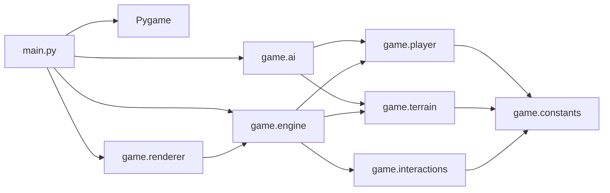
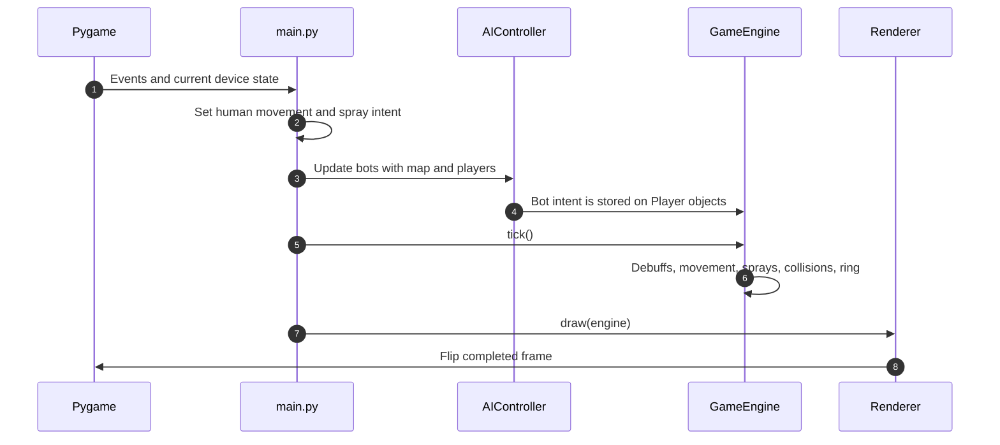
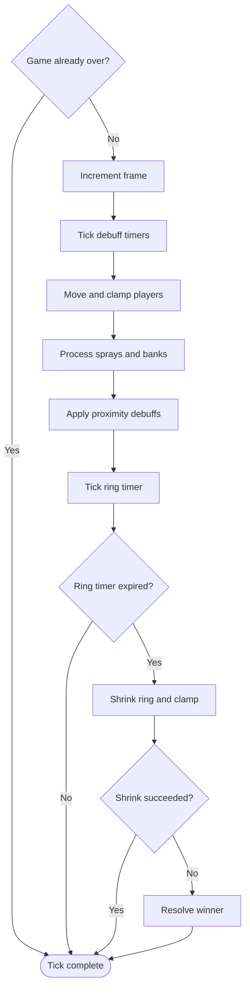
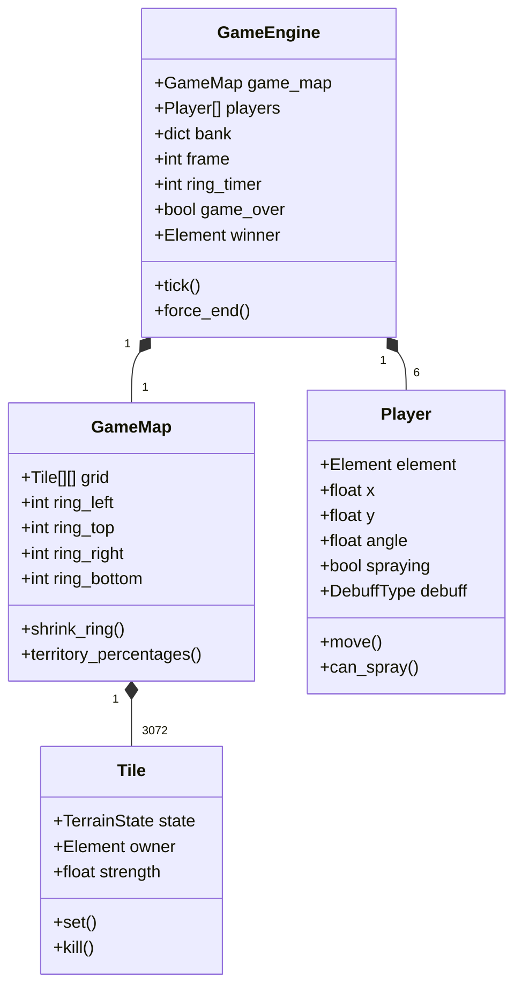
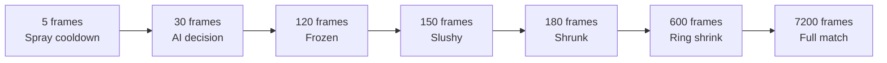
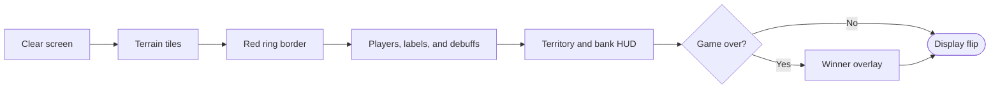

# Architecture

## Design summary

EntropyTag separates its frame-based game simulation from input and rendering:

- `main.py` owns Pygame lifecycle, devices, events, and human intent.
- `AIController` produces bot intent.
- `GameEngine` advances authoritative game state.
- `Renderer` reads engine state and draws it.

This boundary allows the complete match simulation to run without opening a window.



## Module responsibilities

### `main.py`

- Initializes Pygame and joystick support.
- Creates the display, clock, renderer, players, engine, and bots.
- Assigns keyboard and controller state to human players.
- Handles quit, restart, forced end, and joystick hot-plug events.
- Runs AI, simulation, rendering, and the 60 FPS cap.

### `game/constants.py`

- Defines `Element` and `TerrainState`.
- Holds display, tile, player, spray, debuff, ring, bank, AI, color, and movement tuning.
- Derives the 64x48 grid from the 1024x768 arena and 16-pixel tile size.

### `game/player.py`

- Stores elemental identity, player ID, human/bot role, pixel position, movement intent, facing, spray state,
  cooldown, debuff state, and the future-facing `alive` flag.
- Normalizes movement and applies terrain/debuff speed modifiers.
- Exposes effective radius and spray range.

### `game/terrain.py`

- `Tile` stores terrain state, owner, and unused coating strength.
- `GameMap` owns the row-major tile grid and inclusive ring boundaries.
- Provides bounds queries, ring shrinking, territory counts, and percentages.

### `game/interactions.py`

- Defines the terrain conversion lookup table.
- Defines elemental player counters and their resulting debuffs.
- Keeps rule resolution independent from rendering and input.

### `game/ai.py`

- Controls one bot player.
- Selects wander, territory, or enemy objectives.
- Writes movement and spray intent consumed by the engine.

### `game/engine.py`

- Owns the map, players, frame count, bank scores, ring timer, game-over state, and winner.
- Advances simulation in a fixed and significant order.
- Resolves terrain sprays, bank scoring, proximity debuffs, ring collapse, and winner selection.

### `game/renderer.py`

- Draws terrain, ring boundary, players, debuff outlines, facing indicators, human labels, HUD, and game-over
  overlay.
- Performs no simulation mutations.

## Frame data flow



## Simulation tick order

`GameEngine.tick()` executes:

1. Ignore the tick when the match is already over.
2. Increment the frame.
3. Decrement and clear debuff timers.
4. Move players, decrement spray cooldowns, and clamp players inside the ring.
5. Convert sprayed tiles and award bank points.
6. Apply proximity counter-debuffs.
7. Decrement and possibly shrink the ring.
8. Resolve a winner when another ring shrink cannot fit.

Changing this order can change behavior. For example, debuffs expire before movement, and movement updates
facing before spray geometry is calculated.



## State ownership



Player objects are shared by `main.py`, AI controllers, the engine, and renderer:

- Input and AI write intent fields.
- The engine mutates gameplay state.
- The renderer reads state.

There is no separate event bus, entity-component system, or scene manager.

## Timing model

All timing is expressed in frames:

- Target frame rate: 60 FPS.
- Spray cooldown: 5 frames.
- AI decision interval: 30 frames.
- Frozen: 120 frames.
- Slushy: 150 frames.
- Shrunk: 180 frames.
- Ring interval: 600 frames.

The simulation does not use delta time. A slow frame rate therefore slows the match in real time rather than
catching the simulation up.



## Render composition

The renderer paints a frame from back to front:



## Extension points

The current separation supports several incremental improvements:

- Unit-test `resolve_spray()`, `get_counter_debuff()`, `Player`, `GameMap`, and `GameEngine` without Pygame.
- Add deterministic AI tests by injecting or seeding a random-number generator.
- Introduce a game configuration object instead of relying exclusively on module constants.
- Add game states such as menu, pause, results, and rematch around the engine.
- Add player death/respawn only after defining ring, scoring, and collision interactions.
- Define a real coating-strength mechanic before consuming `Tile.strength`.
- Connect bank progression only after deciding whether it modifies range, width, cooldown, strength, or
  another explicit property.

## Known issues and dormant hooks

### HUD vertical placement

The display is 1024x808, but the HUD begins at y=728:

```python
hud_y = SCREEN_HEIGHT - HUD_HEIGHT
```

This overlays the bottom 40 pixels of the 768-pixel arena and leaves the final 40 display pixels black. The HUD
should begin at y=768 if the arena and HUD are intended to occupy separate regions.

### Order-dependent player debuffs

The collision loop skips a player pair when the lower-index player is not spraying. As a result, a
higher-index attacker cannot debuff a lower-index victim. Pair iteration must evaluate each spraying direction
independently.

### Empty-board forced winner

All teams remain winner candidates at zero territory. With equal banks, insertion order selects Ice. Winner
resolution needs an explicit no-team-territory draw rule.

### Duplicate Fire-on-Mist tuning

`SPEED_MODIFIERS` contains `(Element.FIRE, TerrainState.MIST)` twice. The later 1.00x entry silently replaces
the earlier 0.85x entry.

### Unused bank spread bonus

`BANK_SPREAD_BONUS` and `GameEngine.spread_bonus()` are not called. Bank currently affects only the HUD and
end-game tie-breaking.

### Dormant state

- `Tile.strength` is written but never read.
- `Tile.reset()` has no caller.
- `Player.alive` is never changed.
- No death or respawn system exists.
- The proposed 80% territory win exists only as a comment.

## Validation baseline

The repository was validated on Windows with Python 3.13.14 and Pygame 2.6.1:

- All source compiled successfully.
- Installed requirements had no broken dependencies.
- Headless rendering completed successfully.
- A full AI-driven match completed at frame 7,200 and resolved a winner.

AI outcomes vary because randomness is unseeded.
