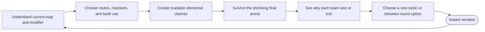
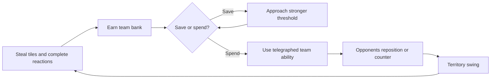

# Engagement and Replayability Design

## Design position

The goal should be to make EntropyTag **compelling enough to earn an immediate rematch**, not to create harmful
or manipulative addiction.

Avoid dark patterns such as paid power, loot boxes, artificial energy limits, fear-of-missing-out timers,
punishing daily streaks, or opaque matchmaking pressure. The healthiest retention comes from:

- Short sessions.
- Clear improvement.
- Fair surprises.
- Social rivalry.
- Expressive play.
- Fast rematches.
- New tactical combinations.

## The desired "one more match" loop

Every step should answer a player question:

- **Learn:** What is different this time?
- **Choose:** What can I do about it?
- **Clash:** Did my action visibly work?
- **Climax:** Can we still turn this around?
- **Explain:** Why did we win or lose?
- **Adapt:** What will I try next?
- **Rematch:** Can we start before excitement fades?

## Build engagement at three time scales

### Moment-to-moment: every 1-5 seconds

Players need frequent readable rewards:

- A tile reacts with a satisfying elemental effect.
- A movement route becomes faster because the team painted it.
- A counter debuff creates a brief opening.
- A teammate extends a reaction combo.
- A bank meter reaches an ability threshold.
- A threatened zone is saved just before the ring closes.

These rewards should be audiovisual and tactical, not only score numbers.

### Match scale: about two minutes

Each match should produce a story:

1. **Opening expansion:** teams establish routes and learn the map modifier.
2. **Mid-match contest:** objectives and bank abilities create reversals.
3. **Compression:** ring pressure forces teams together.
4. **Final scramble:** a small arena makes every tile and debuff matter.
5. **Resolution:** results explain territory, reactions, bank, and decisive moments.

The existing ring already provides this structure. Improvements should reinforce it rather than lengthening
matches.

### Session scale: 5-20 minutes

Support natural stopping points:

- Single two-minute match.
- Best-of-three set lasting roughly seven minutes.
- Small party playlist lasting 15-20 minutes.

Players should be able to stop cleanly without losing earned value or being punished.

## Make mastery visible

Players return when they can name what they are improving.

### Skills worth mastering

- Efficient painting routes.
- Movement on friendly versus hostile terrain.
- Predicting the next ring boundary.
- Aiming while repositioning.
- Creating and consuming reaction terrain.
- Countering the correct enemy at the correct time.
- Coordinating human and bot teammates.
- Choosing when to spend banked ability power.
- Defending a lead versus forcing a comeback.

### Results that teach

The results screen should show:

- Final territory percentage.
- Tiles converted.
- Enemy tiles stolen.
- Elemental reactions triggered.
- Player counters landed and received.
- Bank earned and spent.
- Largest territory swing.
- Final ten-second contribution.

Highlight one understandable lesson, such as:

> "Water won by converting 34 Fire tiles during the final ring."

This creates a reason to rematch with a specific adjustment rather than a vague sense of defeat.

## Create fair variability

Randomness should change situations without deciding outcomes.

Recommended sources of variety:

- Three to five authored maps.
- One optional match modifier.
- Rotating central objectives.
- Between-round ability drafts.
- Different bot personalities.
- Slightly varied but symmetrical neutral terrain patterns.

Avoid:

- Random instant player disable.
- Hidden stat changes.
- Untelegraphed terrain resets.
- Large random score awards.
- Spawn advantages.

## Give teams expressive identities

The elements should feel different without becoming impossible to balance.

### Ice identity

- Controls space.
- Creates safe routes and temporary barriers.
- Punishes Water with movement denial.
- Visual language: crisp edges, cracks, crystalline bursts.

### Water identity

- Redirects fights.
- Converts contested states reliably.
- Pushes or flows around defenses.
- Visual language: waves, ripples, splashes, flowing trails.

### Fire identity

- Creates pressure and rapid breakthroughs.
- Excels at aggressive movement and finishing reactions.
- Punishes Ice with persistent speed disruption.
- Visual language: embers, heat distortion, sparks, expanding bursts.

Identity should affect decision style, not merely color and one counter matchup.

## Turn bank into meaningful risk/reward

The bank is the clearest unused engagement opportunity.

Recommended loop:

Important balance rule: bank should reward active contested play, not simply make the leading team stronger
for already owning the map.

## Add between-round adaptation, not permanent power

For a best-of-three set, offer each team one of two or three temporary choices after a round:

- Longer friendly-terrain speed trail.
- Faster spray-pressure recovery.
- Slightly wider reaction combo window.
- Earlier warning of the next ring.
- Alternative team ability behavior.

All choices reset after the set. Permanent progression should unlock cosmetics, celebrations, announcer
styles, trails, and profile statistics rather than gameplay power.

## Use social energy

EntropyTag's largest advantage is simultaneous local play.

Add features that create friendly rivalry:

- One-button team rematch.
- Random team shuffle.
- Best-of-three and king-of-the-couch playlists.
- Short post-match awards such as "Reaction Master" or "Final Ring Hero."
- Optional handicaps selected openly for mixed-skill groups.
- Controller vibration and team-specific victory celebrations.

Do not interrupt the group with long menus, account prompts, or individual reward screens.

## Improve comeback potential without invalidating skill

A two-minute match needs hope until the final seconds.

Good comeback tools:

- Final-ring tiles are naturally more valuable because fewer remain.
- Losing teams gain a small bank bonus for stealing leader-owned tiles.
- The leading team becomes visually identifiable and attracts pressure.
- Central objectives create temporary opportunities rather than free score.
- Strong abilities are telegraphed and counterable.

Bad comeback tools:

- Secretly slowing the leader.
- Randomly deleting leader territory.
- Giving the losing team unavoidable damage.
- Hiding rubber-band rules.

Players accept comeback mechanics when they are visible, symmetric, and require execution.

## Improve bots as engagement partners

Bots should make solo and incomplete-party play interesting without pretending to be human.

Use bot personalities:

- **Painter:** prioritizes efficient territory routes.
- **Hunter:** seeks favorable elemental counter matchups.
- **Guardian:** protects threatened friendly zones.
- **Opportunist:** targets reactions, objectives, and weakened enemies.

Display the bot role during setup so human teammates can plan around it. Difficulty should affect planning and
accuracy, not hidden stat advantages.

## Recommended retention package

For the first polished release, implement:

1. Three maps.
2. Standard two-minute territory mode.
3. Best-of-three local set.
4. One active ability per element powered by bank.
5. Directional aiming and honest hit detection.
6. Strong reaction, debuff, ring, and score feedback.
7. Results that explain decisive actions.
8. Instant rematch.
9. Four readable bot personalities.
10. Cosmetic-only local progression.

This is enough to create repeated play without building a live-service economy.

## Success criteria

The game is becoming genuinely compelling when playtests show:

- New players understand the objective within one match.
- Players can explain at least one elemental reaction after two matches.
- Losing players usually know one tactic they want to change.
- Groups voluntarily choose rematch without prompting.
- Different maps change routes and strategies.
- Matches remain close because of visible contest, not hidden rubber-banding.
- Players stop at natural set boundaries and still want to return later.

The most valuable metric is not raw session length. It is the percentage of groups that start a voluntary
second match and can explain why they want another attempt.

