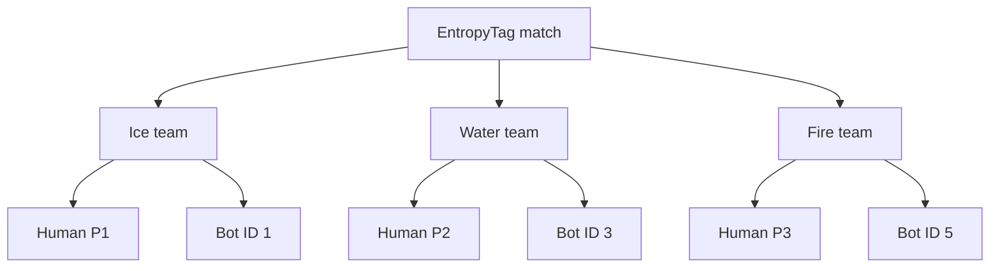
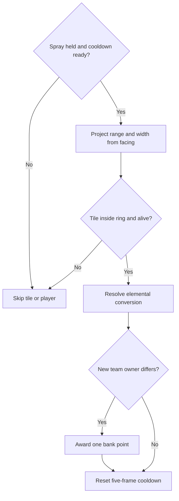
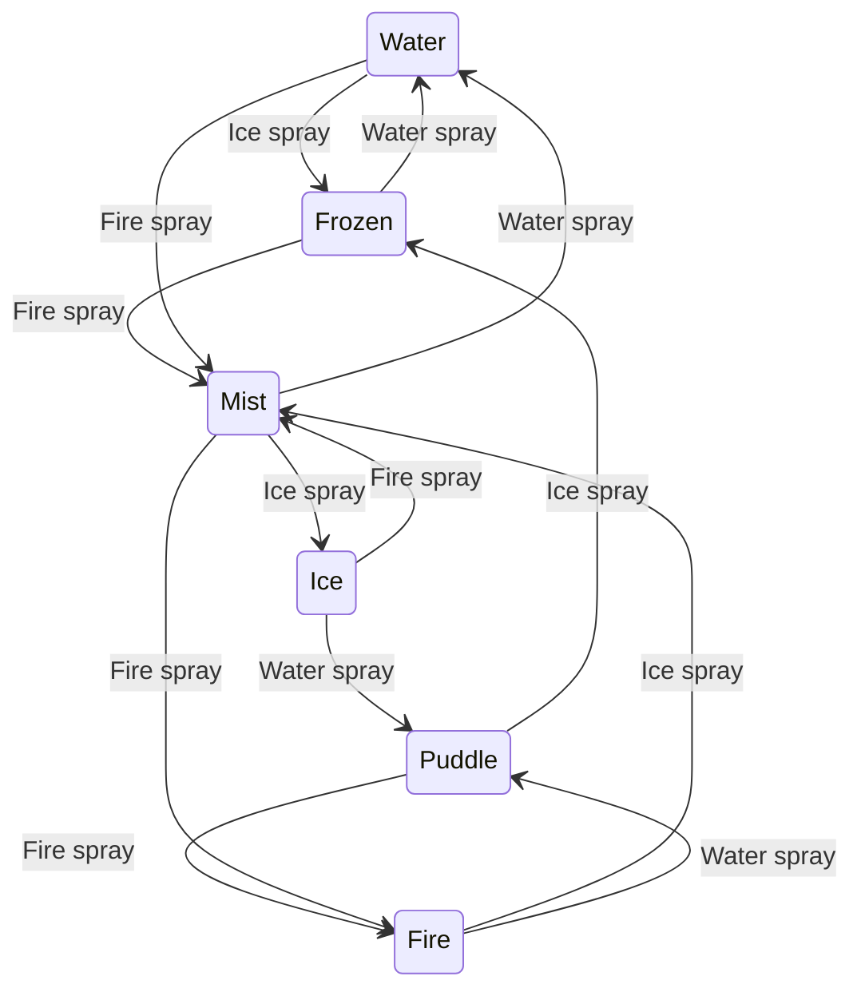
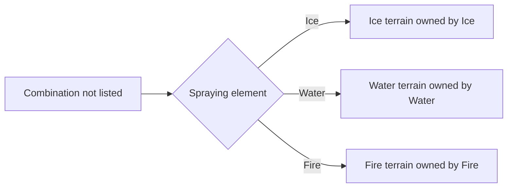
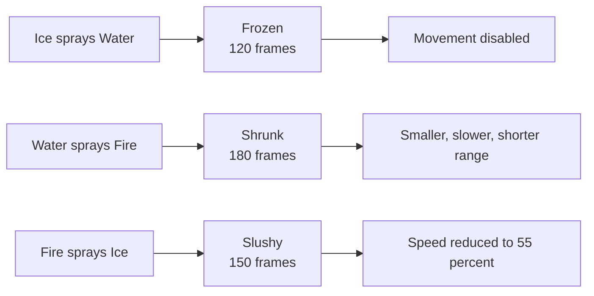
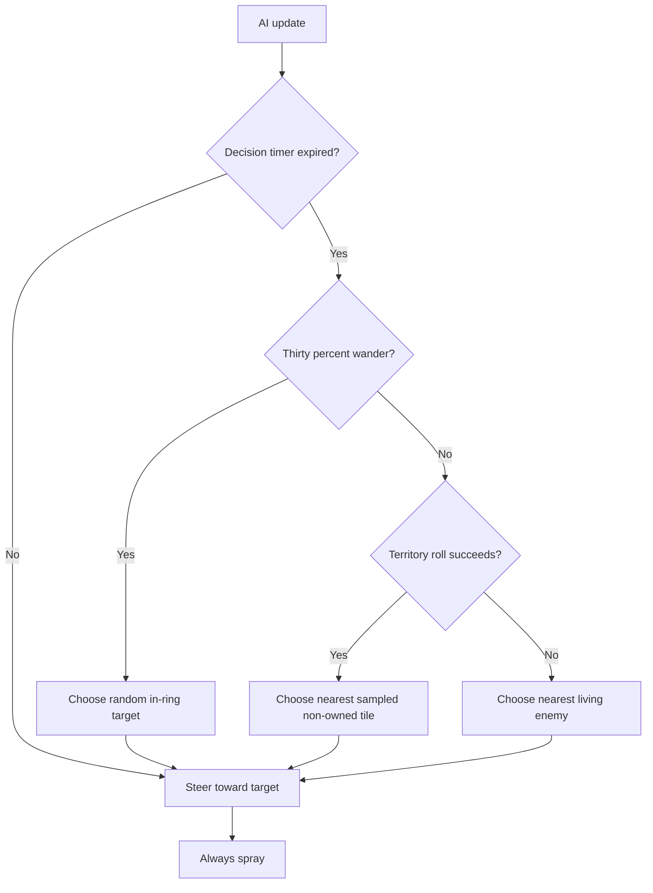
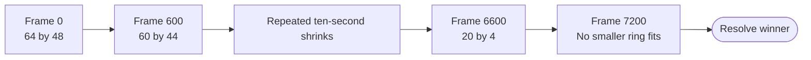
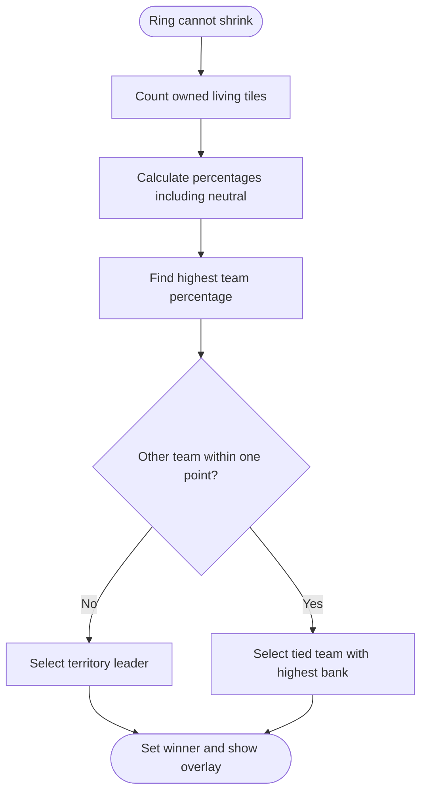

# Gameplay and Rules

## Match setup

EntropyTag creates six players in a fixed order:

| ID | Team | Control | Spawn tile |
|---:|---|---|---|
| 0 | Ice | Human | `(5, 5)` |
| 1 | Ice | Bot | `(10, 8)` |
| 2 | Water | Human | `(58, 42)` |
| 3 | Water | Bot | `(53, 39)` |
| 4 | Fire | Human | `(32, 5)` |
| 5 | Fire | Bot | `(36, 8)` |

All 3,072 arena tiles begin neutral. Players begin at tile centers and initially face right.

## Movement

Base movement speed is 3 pixels per frame. Direction input is normalized, so diagonal movement does not provide
additional speed.

### Terrain speed modifiers

| Player | Terrain | Multiplier |
|---|---|---:|
| Ice | Ice | 1.40x |
| Ice | Fire | 0.70x |
| Ice | Puddle | 0.85x |
| Ice | Frozen | 1.20x |
| Water | Water | 1.40x |
| Water | Ice | 0.70x |
| Water | Frozen | 0.60x |
| Water | Puddle | 1.20x |
| Fire | Fire | 1.40x |
| Fire | Water | 0.70x |
| Fire | Mist | 1.00x |

All unspecified combinations use a 1.00x multiplier.

> Fire on Mist is currently defined twice in the source. Python keeps the later 1.00x value and discards the
> earlier 0.85x value.

## Spraying

- Base range: four tiles.
- Nominal width: five tiles.
- Cooldown: five frames between spray updates.
- Direction: the player's current facing angle.
- A stationary player continues spraying in its last facing direction.
- Dead tiles outside the ring cannot be converted.

When a spray changes a tile from another owner or neutral ownership to a team owner, that team receives one
bank point.

## Terrain conversion table

Unlisted combinations become the spraying team's primary terrain and ownership.

| Spray | Existing terrain | Result | Owner |
|---|---|---|---|
| Ice | Water | Frozen | Ice |
| Ice | Puddle | Frozen | Ice |
| Ice | Fire | Mist | None |
| Ice | Mist | Ice | Ice |
| Water | Fire | Puddle | Water |
| Water | Ice | Puddle | Water |
| Water | Frozen | Water | Water |
| Water | Mist | Water | Water |
| Fire | Ice | Mist | Fire |
| Fire | Frozen | Mist | Fire |
| Fire | Water | Mist | Fire |
| Fire | Puddle | Fire | Fire |
| Fire | Mist | Fire | Fire |

Primary terrain defaults:

- Ice spray creates Ice.
- Water spray creates Water.
- Fire spray creates Fire.

## Player counters and debuffs

Opposing players within 20 pixels can receive a debuff when the countering player is spraying.

| Attacker | Victim | Debuff | Duration | Effect |
|---|---|---|---:|---|
| Ice | Water | Frozen | 120 frames | Movement stops |
| Water | Fire | Shrunk | 180 frames | 0.80x speed, half radius, half spray range |
| Fire | Ice | Slushy | 150 frames | 0.55x speed |

An active debuff is not refreshed or replaced. The proximity check currently does not consider spray direction
or whether the visual spray geometry reaches the victim.

## Bots

Each team has one bot. Bots reevaluate their objective every 30 frames and always spray.

Decision probabilities:

- 30% wander to a random point inside the ring.
- 42% seek a sampled tile not owned by their team.
- 28% chase the nearest opposing player.

AI randomness is not seeded, so matches are nondeterministic.

## Shrinking ring

- The ring shrinks every 600 frames, approximately ten seconds at 60 FPS.
- Each successful shrink removes two tile rows or columns from every edge.
- Removed tiles become Dead and lose ownership.
- Players outside the new boundary are moved inside rather than eliminated.
- Eleven successful shrinks leave a 20x4 live arena.
- The next shrink attempt fails at frame 7,200 and ends the match.

The resulting intended match duration is approximately 120 seconds.

## Winner and bank scoring

At game end:

1. Count each team's owned tiles within the final live ring.
2. Convert those counts to percentages of all living tiles, including neutral tiles.
3. Select the team with the highest percentage.
4. If teams are within less than one percentage point, select the tied team with the highest bank.

The HUD displays bank points, but the intended bank-based spread bonus is not currently connected to gameplay.

## Current gameplay limitations

- Players cannot die or respawn.
- There is no active early-win or dominance condition.
- A forced end on a completely neutral board incorrectly declares Ice the winner.
- Player debuff collision handling depends on player list order.
- Tile coating strength exists in data but has no gameplay effect.
