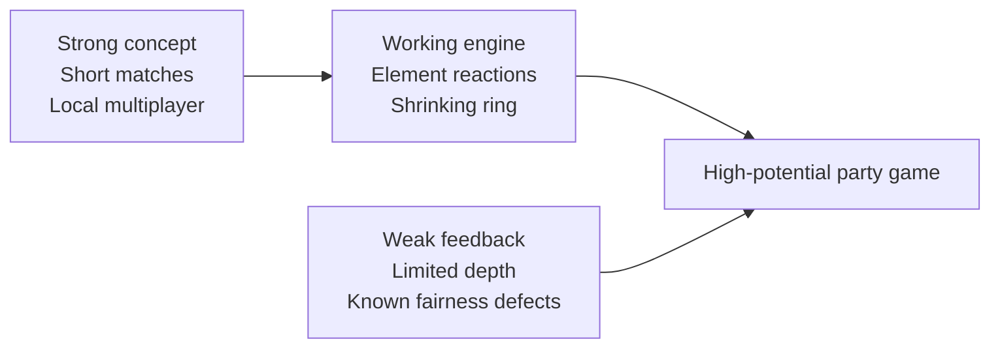

# EntropyTag Prototype Review

## Executive verdict

**Current prototype rating: 6.5/10.**

EntropyTag has a strong party-game premise and a codebase that proves the complete match loop works. The
elemental territory reactions are the best idea in the prototype: they give painting the arena more meaning
than simply replacing one team color with another. The shrinking ring also gives every match a natural
two-minute arc.

The current build is better described as a functional game-system prototype than a finished game. It can
produce interesting situations, but it does not yet provide enough feedback, tactical variety, fairness, or
presentation quality to sustain repeated play without developer enthusiasm filling the gaps.

## Scorecard

| Category | Score | Assessment |
|---|---:|---|
| Core concept | 8.0/10 | Three-way elemental territory control is distinctive and easy to pitch. |
| Immediate readability | 6.5/10 | Team colors and terrain are clear, but reactions and debuffs need stronger feedback. |
| Controls | 6.0/10 | Three local players work, but movement also determines aim and keyboard schemes are crowded. |
| Game feel | 4.5/10 | Functional circles and tiles lack sound, particles, animation, impact, and satisfying conversion feedback. |
| Tactical depth | 5.5/10 | Terrain speed and elemental reactions create decisions, but maps, abilities, and objectives are limited. |
| Match pacing | 7.0/10 | The shrinking ring creates urgency and a reliable two-minute finish. |
| Fairness and clarity | 5.0/10 | Directionless proximity debuffs and order-dependent collision handling can produce confusing outcomes. |
| AI | 5.5/10 | Bots keep the field active, but their always-spray behavior and simple targeting are predictable. |
| Replayability | 4.5/10 | Random AI varies outcomes, but every match uses the same arena, teams, rules, and progression. |
| Technical foundation | 7.0/10 | Simulation/render separation is a good base, but tests and several mechanics are unfinished. |
| Local multiplayer potential | 8.5/10 | Short simultaneous matches and elemental rivalries suit couch play very well. |
| Production readiness | 3.5/10 | No menus, audio, accessibility options, save data, polish pipeline, or automated tests. |

## What already works

### A pitch that is easy to understand

"Three elemental teams paint and transform a shrinking arena" is a compact premise with immediate visual and
mechanical identity. Ice, Water, and Fire provide familiar expectations while the conversion table creates
room for surprising interactions.

### Matches have a beginning, escalation, and ending

The ring shrinks every ten seconds and ends the match at about two minutes. This is excellent for a local
competitive game because:

- New players do not remain trapped in a losing match for long.
- The playable space steadily forces more interactions.
- The final 20x4 arena creates a natural climax.
- Restarting is cheap enough to encourage rematches.

### Territory affects movement

Friendly terrain is not only a score color; it also improves mobility. That creates a useful positive loop:
claiming space makes a team more effective in that space. Hostile terrain slows specific elements, so routes
and positioning can matter.

### Elemental terrain has multi-step reactions

Frozen, Puddle, and Mist states allow tiles to tell a short history. A contested area can move through several
states instead of changing directly from one team to another. This is the prototype's most valuable design
direction and should be expanded carefully.

### The code is approachable

The repository is small, modules have clear responsibilities, and simulation logic can run without Pygame.
That foundation makes it practical to test and iterate on game rules quickly.

## What holds the game back

### Actions do not yet feel powerful

Spraying changes rectangles on a grid, but there is no audio, animation, recoil, particles, screen response,
controller rumble, or reaction-specific effect. The game computes interesting events without celebrating
them. Players need to feel:

- The start and rhythm of a spray.
- A successful enemy-tile conversion.
- A special elemental reaction.
- A player debuff landing.
- A ring shrink approaching and occurring.
- A lead change or close finish.

### Player interaction is not spatially honest

Debuffs currently use a 20-pixel proximity check and do not verify spray direction or spray-cone contact.
Players may be hit when the visible action does not communicate a hit. The list-order bug makes this less
fair. Competitive games can tolerate simple rules, but the result must match what players see.

### Strategic options are too narrow

Players can move and spray, and terrain changes speed. There are no:

- Active abilities or cooldown decisions.
- Obstacles, lanes, hazards, or map features.
- Temporary objectives.
- Pickups or resource-spending choices.
- Team roles or loadouts.
- Reasons to stop spraying.

Because bots always spray and human spraying has no resource cost, continuous spraying is usually the obvious
choice.

### The bank does not fulfill its promise

Bank points are visible and break close ties, but the named spread bonus is unused. Players cannot make a
meaningful decision with banked value. This is a missed opportunity for risk/reward and match identity.

### The presentation is still diagnostic

The current renderer communicates state like a debug visualization. That is appropriate for an early
prototype, but a game needs a stronger visual hierarchy:

- Distinct player silhouettes or icons.
- Animated terrain edges and reaction transitions.
- Clear team meters and lead indicators.
- An obvious ring countdown.
- A readable results screen explaining why a team won.
- Menus for controls, controller assignment, and rematch flow.

## Best-fit audience

The strongest direction is a **2-6 player local party-action game** with bots filling empty team slots.
Potential reference qualities are:

- The immediate territorial satisfaction of painting games.
- The compact rounds and readable chaos of couch party games.
- The counterplay and positional ownership of arena battlers.

EntropyTag should not try to become a large online competitive service before proving that one room of players
wants an immediate rematch.

## Final assessment

The prototype is successful at proving that the central systems can coexist:

- Six players can operate in one match.
- Territory conversion, movement modifiers, elemental reactions, bots, scoring, and ring collapse run
  together.
- A winner is produced reliably.

Its next challenge is not adding more raw systems. The next challenge is making every existing system legible,
fair, satisfying, and worth mastering. With a focused polish and depth pass, the concept could move from a
6.5/10 prototype to an 8/10 local multiplayer game.

