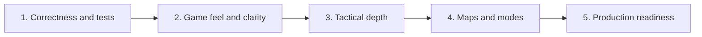

# EntropyTag Improvement Roadmap

## Goal

Turn the working systems prototype into a fair, readable, satisfying local multiplayer vertical slice before
expanding content or considering online play.

The order matters. Fix correctness first, then improve feedback, then deepen decisions, then add content.
Adding maps or progression before the core interaction feels fair would multiply rework.

## Priority 0: Make current rules correct and trustworthy

These changes should happen before design expansion.

### Fix confirmed defects

1. Place the HUD below the 768-pixel arena instead of over its final rows.
2. Evaluate both attack directions for every opposing player pair so debuffs do not depend on list order.
3. Treat a board with no team-owned territory as a draw.
4. Remove the duplicate Fire-on-Mist speed key and explicitly choose either 0.85x or 1.00x.
5. Decide whether player hits require actual spray-cone overlap; they should match visible geometry.

### Add a simulation test suite

Start with tests for:

- Every explicit and default terrain conversion.
- The three player counter matchups and non-counter matchups.
- Terrain and debuff speed modifiers.
- Spray cooldown and Shrunk range.
- Bank awards for neutral, enemy, friendly, and neutral-result conversions.
- Ring dimensions at every shrink.
- Winner, close tie, bank tie-break, and all-neutral draw.
- Collision behavior independent of player ordering.

### Clean repository hygiene

- Stop tracking `__pycache__` and bytecode.
- Keep `.venv` ignored.
- Add a deterministic random seed option for tests and reproducible debugging.
- Add a minimal command for automated headless validation.

## Priority 1: Make the existing game feel good

### Spray feedback

- Animate a short spray stream or droplets between player and affected tiles.
- Add a distinct looping spray sound for each element.
- Pulse or ripple tiles when ownership changes.
- Use stronger one-shot effects for Frozen, Puddle, and Mist reactions.
- Briefly highlight bank gains near the converted area or team HUD.
- Add controller rumble when a player lands or receives a debuff.

### Player readability

- Replace plain circles with simple elemental characters or strongly differentiated silhouettes.
- Add team-colored direction cones while spraying.
- Show debuff icons and remaining duration above affected players.
- Add a short spawn marker and optional player-number arrow.
- Use patterns or symbols in addition to color for color-vision accessibility.

### Ring and match feedback

- Show a circular or segmented countdown for the next shrink.
- Flash the future unsafe boundary two seconds before shrinking.
- Animate dead terrain instead of switching instantly to dark gray.
- Add a ten-second final-phase announcement.
- Present territory delta, bank contribution, and reaction counts on the results screen.

### Menus and flow

- Add a title screen.
- Add controller/keyboard assignment and ready state.
- Add a concise in-game controls overlay.
- Add pause, restart confirmation, and rematch.
- Make results-to-rematch take one button and less than five seconds.

## Priority 2: Add tactical decisions

### Separate aim from movement where possible

Controller players should use:

- Left stick for movement.
- Right stick for aim.
- Trigger for spray.

For keyboard players, choose between:

- Eight-direction aim keys.
- Aim follows movement but locks while spraying.
- Mouse aim for one player.

Independent aim immediately raises mastery and makes visible spray-cone hits fairer.

### Give spraying a meaningful constraint

Continuous spraying is currently dominant. Add one of:

- A pressure meter that drains while spraying and refills while moving on friendly terrain.
- Heat for Fire, water capacity for Water, and chill charge for Ice, normalized to equal gameplay value.
- Short burst windows with tactical cooldowns.

The constraint should create a rhythm of **paint, reposition, recover, strike**, not long periods of inactivity.

### Turn bank into a decision

Recommended design: team bank fills an elemental ability meter, but teams choose when to spend it.

Possible team abilities:

- **Ice - Glacier Wall:** briefly creates a line of blocking Frozen tiles.
- **Water - Tidal Push:** sends a wave that converts terrain and pushes players.
- **Fire - Overheat Dash:** grants a short fast trail that ignites passed tiles.

Balance safeguards:

- Do not make the leading team's meter fill much faster solely because it already owns more territory.
- Award bank for difficult conversions and reactions, not passive ownership.
- Telegraph abilities and allow counterplay.
- Consider a small meter gain for teams that lose territory to reduce runaway leads.

### Add reaction combos

Reward deliberate multi-step play:

- A reaction completed within a short window earns bonus bank.
- Teammates can extend or consume reaction terrain.
- A clear combo label explains what happened.
- Repeatedly painting the same uncontested tile should be worth little or nothing.

### Add map decisions

Introduce authored maps with:

- Obstacles that block movement and spray.
- Narrow lanes and open control zones.
- Element-neutral speed pads.
- Destructible or temporarily convertible barriers.
- Central high-value objectives.
- Symmetrical spawn safety.

## Priority 3: Add replayable content

### Maps

Build three maps before adding many modes:

1. **Open Arena** - closest to the prototype; teaches fundamentals.
2. **Crossroads** - central objective with four approach lanes.
3. **Islands** - separated zones connected by risky bridges.

Each map should change movement and spray decisions, not merely use different colors.

### Match modifiers

Use one clearly announced modifier per match:

- Fast ring.
- Moving safe zone.
- Double reaction bank.
- Low spray pressure.
- Neutral storms that reset small areas.
- Team abilities charge faster.

Modifiers create variety cheaply but should remain optional in competitive presets.

### Modes

After standard territory control is polished:

- **Best of Three:** short competitive set with one upgrade choice between rounds.
- **Reaction Rush:** score primarily from elemental reaction chains.
- **Core Control:** hold rotating objectives while territory affects movement.
- **Solo Challenge:** one human with a team bot against increasingly capable opponents.

## Priority 4: Improve AI

Replace purely random mode selection with readable goals and utility scoring.

Bots should evaluate:

- Nearby threatened friendly territory.
- Safe and unsafe ring locations.
- Vulnerable countered enemies.
- Current spray pressure or resource.
- Team ability opportunities.
- Whether the team is leading and should defend or losing and should contest.

Add skill levels by changing reaction time, planning horizon, aim error, and cooperation rather than giving
bots unfair speed or spray power.

## Priority 5: Production readiness

- Settings for volume, controls, vibration, screen mode, and accessibility.
- Save only local preferences and cosmetic unlocks.
- Automated tests and a smoke-test build command.
- Performance profiling for particles and large terrain updates.
- Packaging for Windows.
- Crash logging that does not capture sensitive user data.
- Only consider online multiplayer after deterministic simulation and local fun are proven.

## Suggested vertical-slice milestone

A convincing vertical slice should contain:

- One polished map.
- Three humans plus optional bots.
- Correct directional player hits.
- Independent controller aim.
- Spray resource rhythm.
- One active ability per element.
- Strong audio/visual feedback.
- Full title-to-rematch flow.
- One standard two-minute mode.
- A headless regression suite.

Do not require progression, online accounts, a store, or a large map catalog for this milestone.

## Module-level implementation map

| Change | Primary files |
|---|---|
| Correct collision and winner behavior | `game/engine.py` |
| Resolve speed tuning and new constants | `game/constants.py` |
| Aim, resource, and active abilities | `game/player.py`, `main.py` |
| Reaction combo rules | `game/interactions.py`, `game/engine.py` |
| Obstacles and map definitions | `game/terrain.py` plus a new map-data module |
| Better bot utility decisions | `game/ai.py` |
| Particles, animation, HUD, menus | `game/renderer.py` plus new UI/state modules |
| Tests | New `tests/` package targeting simulation modules |

